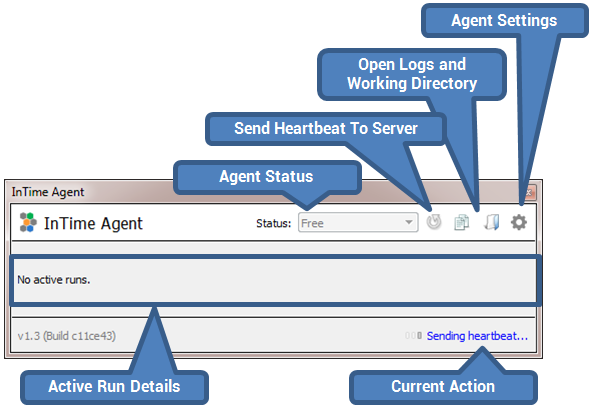

Using InTime Agent
==================

## Running the Agent

### GUI Mode

 The InTime installer creates desktop icons which can be used to launch the InTime Agent in GUI mode. 

Depending on the operating system, the InTime Agent GUI will also register itself in the system tray (Windows, Ubuntu). After starting the agent, a GUI will appear below. 

### Background Mode

Background mode can be enabled using the "-mode background" commandline argument and opens the Agent as a background process. On Linux, the following arguments are also required: "-platform minimal".

For example:

    ./intime_agent.sh -mode background -platform minimal

### Command Line Arguments

The InTime Agent provides the following command line arguments:

-   `-h`: Prints an usage help message.

-   `-v`: Prints the version of the agent.

-   `-nolog`: Indicates that the agent should create a session log file
    for this session.

-   `-username <username>`: Specifies username for the session. When not
    specified, the agent will automatically use the username of the
    current user.

-   `-mode <background,gui>`: Specifies the execution mode of the agent.
    The following options are supported (defaults to `gui`).

    -   `background`: Execute in background mode without showing the
        agent's user interface. When using this mode, also add the
        following argument to avoid the loading of system display
         libraries into memory upon agent startup: `-platform minimal`.
    -   `gui`: Execute in GUI mode, showing the agent's user
         interface.

-   `-locale <locale>`: Specifies the locale for which translations
    should be loaded.

-   `-ip <ip>`: Specifies the IP address of the server for this session.
    When not specified it defaults to the user configured IP address.

-   `-comport <port>`: Specifies the communications port to use for
    communication with the server for this session. When not specified
    it defaults to the user configured port.

-   `-no_agent_limit`: Specifies that multiple agents can run on the
    same machine. By default only one agent is allowed to run on a
    single machine. However in some environments it makes sense to allow
    multiple agents to run on the same machine. When specified, the
    agent's behaviour differs from the default behaviour in the
    following ways:

    -   No agent lockfile mechanism is used.
    -   The location of the agent log and configuration files are
        stored in an unique location per agent session:
        `~/.plunify/<usr>_<mac>_<pid>/` instead of the normally used
        `~/.plunify/<usr>_<mac>/` location.
    -   A concurrent run limit of 1 is *always* used.

-   `-max_runs <count>`: Limits this agent to the specified number of
    runs. When the number of runs have been completed the agent will
    terminate itself. Note that the concurrent run limit of the agent is
    automatically adjusted to respect this limit. Note: When the current
    job is cancelled, the agent will also terminate itself when the
    limit has been reached during the job which is being cancelled.

-   `-remote_job <remote_job_id>`: Limits this agent to a specified
    remote job id. The InTime server will only assign jobs which are
    part of the specified ID to this agent. Note: When the current job
    is cancelled, the agent will terminate itself as it will not be able
    to accept any other jobs and therfore has no reason to stay alive.

For more information on how to launch Agents dynamically, please refer to the configuration [page](/configuration_enterprise/#configure-intime-agent).
