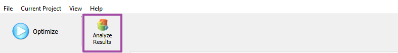
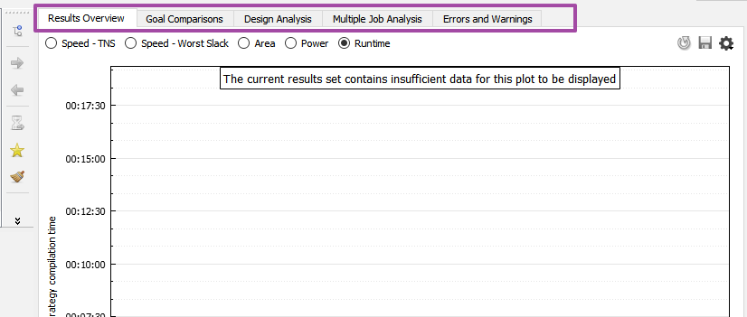
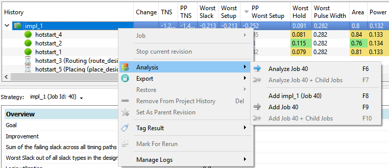
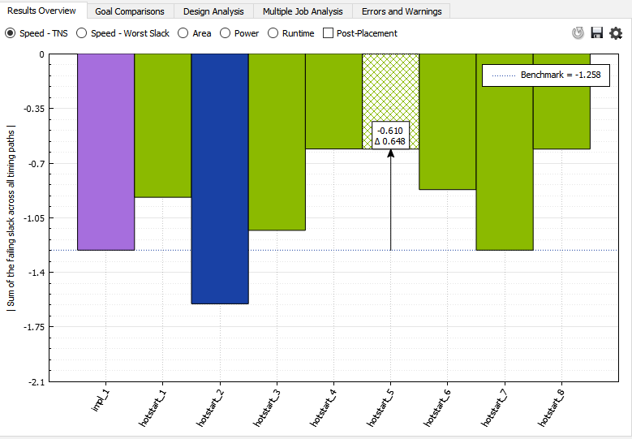
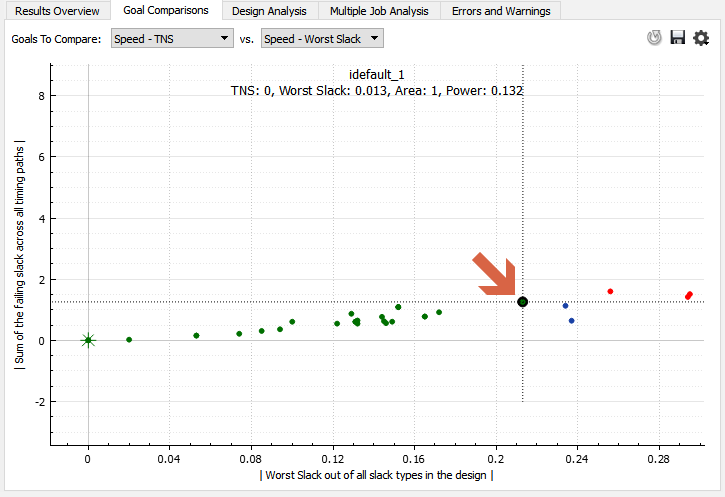
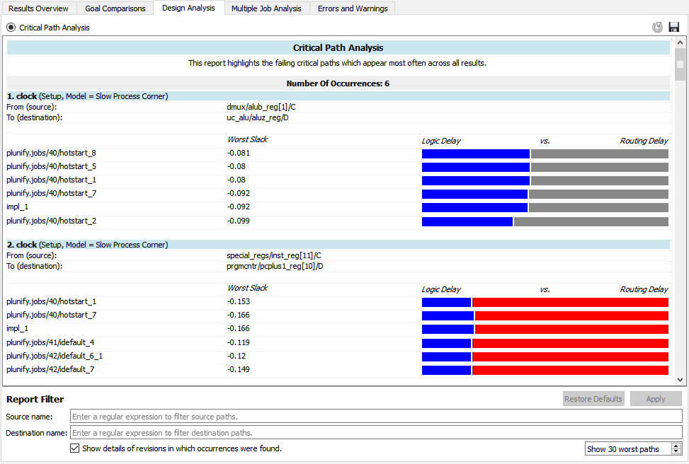
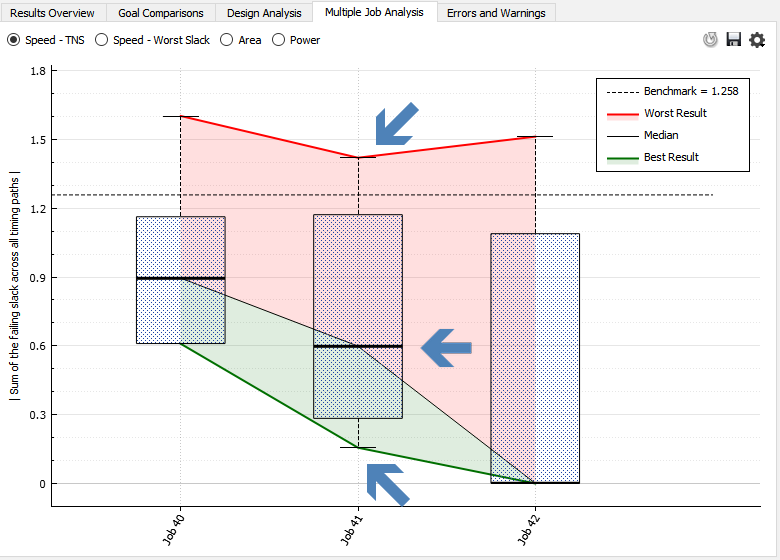
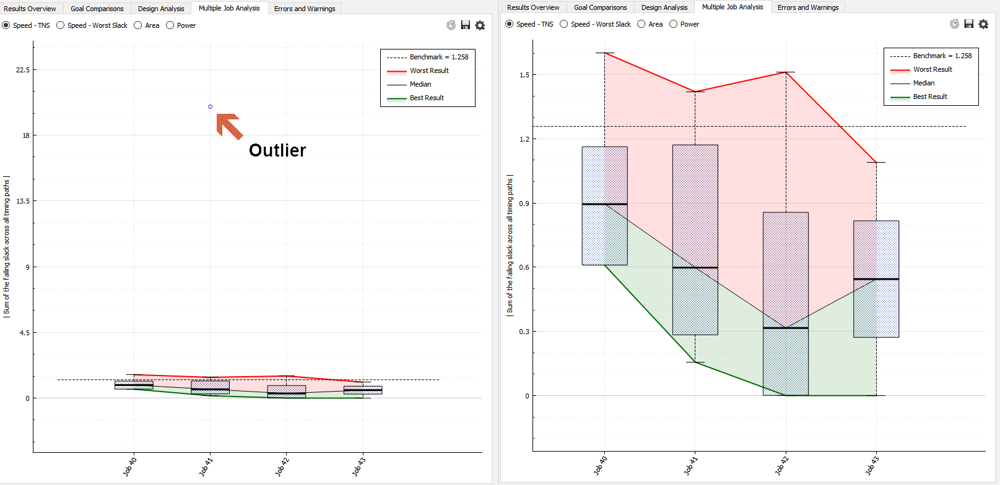
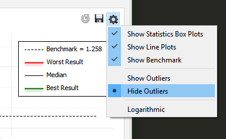
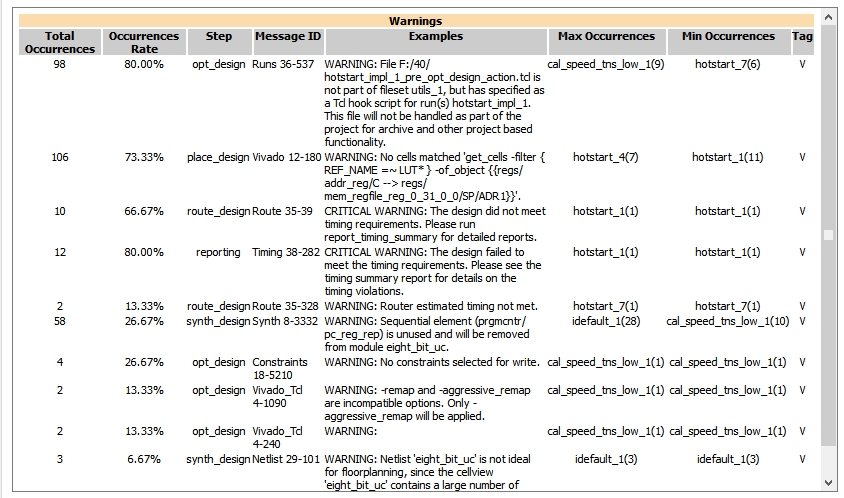

Analyzing InTime Results
=========================

## Starting the Analysis

Additional analysis features can be access by clicking on the button "Analyze Result" in the InTime GUI. 
 

A new GUI below will be displayed with 5 tabs.
 

Tab Name | Description 
---------| -----------
**Results Overview** | Plots a chart of all the runs showing TNS, Worst Slack, Area, Power, Runtime.
**Goal Comparisons** | Plots 2 different design attributes against each other. The attributes supported are TNS, Worst Slack, Area, Power.
**Design Analysis**  | Analyzes the critical paths across the select runs and highlighting the most common ones.
**Multiple Job Analysis** | Provides an overview and progress of the whole optimization process.
**Errors and Warnings** | Aggregate all the warnings and errors to give an overall view of the design.

### Add Jobs To Analysis

Before running any analysis, select and add results data to the analysis dataset.
Right-click on a existing job/strategy, and choose `Analyze Job <Job ID>`. This will add this job (and its child jobs) to the pool of data to be analyzed.
 

You can also add multiple jobs for analysis simply by using the `Add Job <Jobd ID>` option. To add a single strategy, just click on the strategy and select the `Add <strategy name>` option.

To clear the Analysis, go to `View`, `Analysis` and `Clear Current Analysis`

#### Results Overview

After adding the jobs, the "Results Overview" will automatically plot the values. The purple column is the original parent revision. The green columns represent results better than the parent revision and blue means worse. Selecting a column will reveal what is the actual value as well the difference between this and the parent revision.

 

!!! Tip "Post-Placement Estimates"
    For TNS and Worst Slack, there is an additional checkbox called "Post-Placement". This will plot the post placement timing estimates on the same chart.

#### Goal Comparisons

To understand where is the sweet spot between Area and Timing, the "Goal Comparison" chart can help provide insights. In the chart below, the dot indicated by the red arrow is the starting revision. All the points that are better for both axis will be coloured green. Blue is for one axis and red is if it is worse than the original on both axis.   

 

#### Critical Path Analysis

The Design Analysis tab provides insights on the critical paths in the design. The goal is to highlight the occurences of the same critical path in the multiple builds. Refer to the [Critical Path Analysis](design_analysis.md) page to understand more.

 

#### Multiple Job Analysis 

Provides an overview and progress of the whole optimization process. In this chart, each job is denoted in a column. (Note that the Y-axis of the chart inverts the negative values) There are 3 main lines in this chart (denoted by the blue arrows). The red line indicates the worst result in this job. The black thick line is the median (50th percentile) and the green line is the best result of this job. 

 

The main use of this chart is to check whether the learning gains are diminishing. One of the key sign is that the black line is plateauing. This usually starts happening after 3 rounds of learning recipe or about 50-80 strategies, e.g. Default. 

!!! Success "Tip: Use chart settings - Hide outliers"
	The FPGA tools can give a very wide spread of values for different results, especially for TNS. In the charts below, both are showing the same dataset in the analysis. However, the one on the left includes 1 outlier datapoint. By hiding the outlier, the chart is more intutive and easier to comprehend. 
	 

	To hide outliers, click on the Settings button, and choose "Hide Outliers". 
	

#### Errors and Warnings

This tab aggregates all the warnings and errors to give an overall view of the design. Given the high number of warnings, info messages, it is easy to miss out important warnings, such as "critical warnings". Aggregating the warnings gives a fast, simplified and straightforward grasp of the important warnings and errors. For example, if a critical warning in placement is happening across all the strategies, it is an indication of a design issue.

An explanation of the columns is provided below. 

 

Column Names | Description
-------------| --------------
**Total Occurrences** | The total number of occurences across all the results in the analysis. 
**Occurrences Rate** | The overall occurrence rate (%) across all the results in the analysis.
**Step** | FPGA flow step where this happened.
**Message ID** | FPGA vendor specific warning or error ID.
**Examples** | Sample warning or error message.
**Max Occurrences** | Strategy with the maximum number of occurences.
**Min Occurrences** | Strategy with the minimum number of occurences. 

