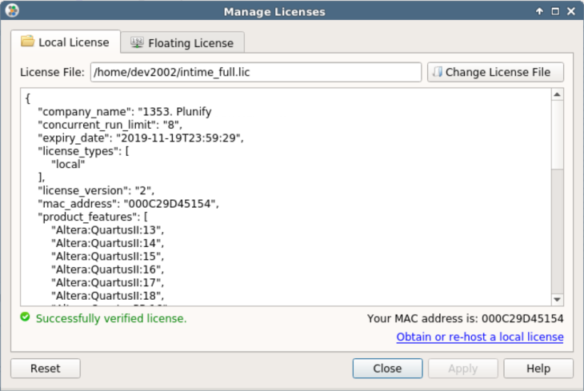

InTime Configuration
==========================

**Pre-requisites** 

1.  InTime is installed on the current machine or a shared network drive.
2.  One or more FPGA software installations used to build the design.

## Step 1: License Registration

A video tutorial showing how to register your local license is also available [here](http://plunify.com/docs/intime_video_1.php).

### Using InTime GUI

After starting InTime GUI, if you are registering a license for the first time, the manage license widget will indicate that no license is currently registered. The *Manage License* widget can be used to view the state of the registered license at any time. 


#### Node-Lock
For **node-lock** license, click on the "*Change License File*" button and browse to your license file. If the selected license file is valid, it will be loaded and its contents shown and InTime will indicate that the license was successfully verified as shown.



#### Floating
For **floating license**, click on the "*Floating License*" tab, and specify the InTime server or the floating license server's IP address. 


---

### Using InTime Tcl Console or Command Line

The InTime GUI comes with a Tcl console at the bottom of the GUI. 

#### Node-Lock
The `license` tcl command provides a set of sub-commands which can be used to manage the registered license. To check the current license,


To register a new license file at "/home/user/license.lic", use the following command:

```tcl
plunify> license register /home/user/license.lic
```

You can also save command in a tcl file, e.g. license.tcl and execute it from the command line.

```bash
intime_sh -mode batch --platform minimal -s license.tcl
```

#### Floating 

When starting InTime from the command line, use the -ip argument to specify the ip address of the License or InTime Server. Use the -comport argument for the port used for the license check.

```bash
intime_sh -ip 192.168.1.1 -comport 39940 -mode batch -s intimeflow.tcl
```
In this example, InTime is executing a Tcl script in batch mode using a license from the license server at 192.168.1.1

## Step 2: Register FPGA Software 

InTime runs on top of the vendor software. When opening a project, InTime will detect the required vendor toolchain and initialize it. Therefore, the vendor tool must be registered before opening any project.

For each tool the following information is required:

-   **Vendor Name:** The name of the tool vendor.
-   **Toolchain Name:** The name of the tool.
-   **Install Path:** The path where this version of the tool is
    installed.
-   **License File:** The path where the license or license server associated with this tool can be found. If not specified, InTime
    uses the `LM_LICENSE_FILE` variable in the environment in which InTime was launched.

--- 

### With InTime GUI

To register and manage toolchains (your installed FPGA software), open the "*File*" > "*Settings*" menu and then select "*Vendor Toolchains*"


New tools can be added either using the auto-detection mechanism (only available on Windows OS) or the *Register Vendor Toolchain* wizard by clicking on the "Add Tool" button.

This wizard gives hints on which path in the tool installation directory needs to be selected and detect the tool version automatically. If the wrong directory in the tool installation tree is selected, an error message will appear.


--- 

### With InTime Tcl Console

Vendor toolchain management in the Tcl environment is done using the `vendors` command. 

```tcl
# Command to auto-detect toolchains (only available on Windows):
plunify> vendors auto_detect
```

To register new tools, use the following command:  
```tcl
# Command to manually register new toolchains:
plunify> vendors register <vendor_name> <toolchain> <install_path> <license_file>
```

!!! tip "To show all registered toolchains"
    Type `vendors list`. It will give a quick overview of currently registered toolchains.

--- 

### Using Command line

To configure InTime via the command line, please [download](https://github.com/plunify/InTime-Vivado/tree/master/scripts/intime/) sample configuration scripts from the Plunify github.

- Edit the *intime_install_FPGA_tools.tcl* to specify the installation path to the FPGA toolchains and their respective licenses. Multiple toolchains can be configured at the same time.

```Tcl
    set yourtoolchainpath(0) "/mnt/Xilinx/Vivado/2018.2"
    set yourtoolchainlicense(0) "/mnt/license_file.lic"
    #
    # If you have multiple toolchains, use an array to specify them
    #
    # set yourtoolchainpath(1) "/mnt/Xilinx/Vivado/2017.4"
    # set yourtoolchainlicense(1) "/mnt/license_file.lic"
    # set yourtoolchainpath(2) ""
    # set yourtoolchainlicense(2) ""
```

- Open the command-line interface, and run the command  

```bash
./intime.sh -mode batch -platform minimal -s intime_install_FPGA_tools.tcl
```

This should configure InTime to recognize where are the FPGA tools and licenses.