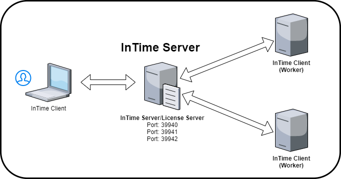
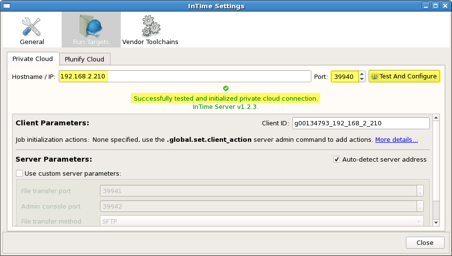
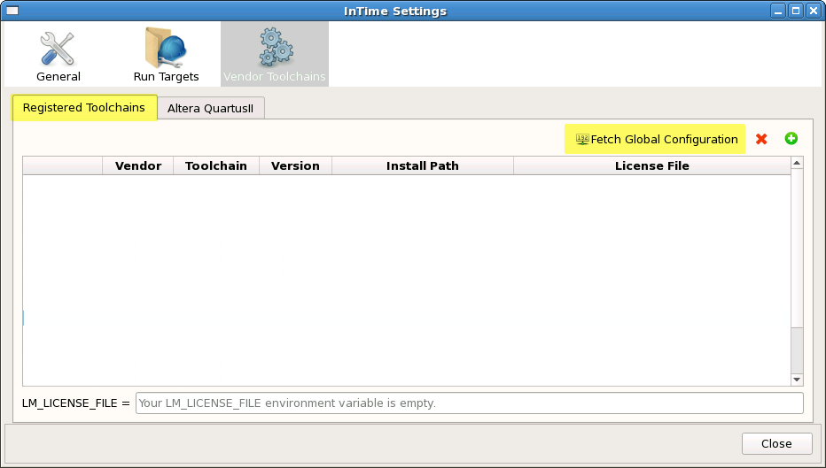
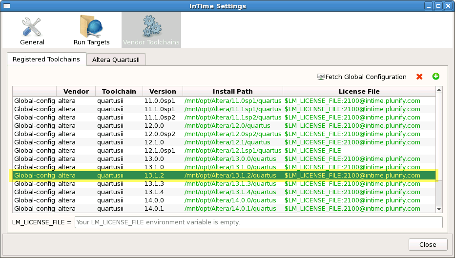

InTime Configuration for Multiple Seats 
==========================================

The InTime enables the use of multiple networked machines or a server farm for design optimization. This mechanism is enabled by specifying "Private Cloud" as a run target in [Flow Properties](flow_properties.md). Multiple architectures, such as LSF and SGE, are supported.

## Private Cloud Configuration Overview

Below is a typical deployment scenario for multiple InTime workers. 

Roles           | Description
----------------|-------------------
InTime Server   | Manages the job scheduling, collating results and license management.
InTime (Worker) | Workers receives job assignments from the Server and runs them.
InTime (Client) | Client submits jobs (FPGA projects) to the Server and collates the results.



This is a scenario of how a project is submitted over the the network to multiple machines.

1. The user starts an InTime Client. User opens a project and submits a job to the InTime Server. Usually this job has multiple revisions or strategies.
2. The InTime Server accepts this job and assigns a *job ID* to it. 
3. The InTime Server queues the job and assigns individual strategy/revision to available InTime Workers.
4. When the InTime Worker has completed their assigned strategy, the results are sent back to the InTime Server.
5. InTime Server will mark the job as completed when all the results are back.
6. InTime client will receive a notification in its next polling request. It will download the results, update the history and complete the job.

### InTime Server Admin Console 

The InTime Server provides an administration console for configuration tasks. Launch the Admin Console.
```bash
$ pwd
/home/intime/intimeserver

$ ./admin_console.sh
InTime Server version: 1.1.0
Git: v1.2.0 (Build cd64f0b)
Type ".help" for instructions. For help on any command, type ".help.<command>"

user>
```

After launching the console, enter Admin mode using the `.admin`
command:
```bash
user>.admin
admin>
```

To leave `Admin` mode and return to `User` mode, type `.user`. To exit the Admin Console when in User mode, type `.exit`.  
For more information on the features, see the [Private Cloud Administration](private_cloud_administration.md) documentation.


## Configure Build Environment

To configure all the InTime clients/workers at the same time, InTime uses a setting called "global configuration". All the InTime clients/workers will retrieve this "global configuration" from the InTime Server. 

In this example, the FPGA tool is installed at `/mnt/opt/Vivado/2019.1` and the tool license is a floating one located at `2100@192.168.10.2`.

```bash
admin> .global.set.toolchain

Enter Operating System for tool, use .end to exit session.
Operating System: ('1' for Linux, '2' for Windows) [1]

admin.os> 1

Enter tool, use .end to exit session.
Tools: ('1' for QuartusII, '2' for ISE, '3' for Vivado, '4' for QuartusPP)

admin.tool> 1

Enter installation path, use .end to exit session.
For example, /opt/Vivado/2014.2

admin.path> /opt/Vivado/2019.1

Enter license path, use .end to exit session.
For example, /home/user/nodelock.dat or port@hostname for floating license

admin.license> 2100@192.168.10.2

Operating System  : Linux
Tool              : Vivado
Installation path : /opt/Vivado/2019.1
License           : 2100@192.168.10.2

Save to session? ('y' for Yes or 'n' for No) [y]

admin.confirm> y

Add more toolchain? ('y' for Yes or 'n' for No) [y]

admin.confirm> n

```

To check your what has been confgured, just type `global.toolchain`

```bash
admin> global.toolchain

+-----+-------+--------+-----------+--------------------------------+-------------------+
| NO. | OS    | VENDOR | TOOL      | PATH                           | LICENSE           |
+-----+-------+--------+-----------+--------------------------------+-------------------+
| 1   | LINUX | Altera | QuartusII | /mnt/opt/Altera/13.1.2/quartus | 2100@192.168.10.2 |
+-----+-------+--------+-----------+--------------------------------+-------------------+
```

The InTime Clients and Agents in the network will automatically fetch the toolchain information. Agents will poll and refresh this information at regular intervals. However, if a Client is already running while the Server configuration was being changed, the user must manually fetch the updated information. Alternatively, restart the Client if possible.

To view the rest of the global configuration commands, use the `.global` command:
```bash
user>.global
+-----------------------+---------------------------------------------+
| USAGE                 | DESCRIPTION                                 |
+-----------------------+---------------------------------------------+
| .global.client_action | show configured client settings for workers |
| .global.setting       | show configured setting for workers         |
| .global.toolchain     | show configured toolchains for workers      |
+-----------------------+---------------------------------------------+
```

## Configure Working Directory 

Each worker requires a location where the build is first saved and compiled. This is called the "working directory". By default the working directory is located at `<user home>/plunify`. It might be necessary to change this due to diskspace limitations on the volume. To change the working directory, use `.global.set.jobsdir` in Admin mode.

```bash
user>.admin
admin>.global.set.jobsdir=<new working directory path>
```

## Configure InTime Agent 

The InTime Agent is responsible for notifying the InTime Server when an InTime worker is online or available. Upon starting the InTime Agent, it will send a notification to the Server that this machine is online. It also informs the InTime Server of its status, such as "Busy", "Pending" etc. The InTime Agent will actively poll the Server. If the agent is uncontactable for an extended period of time, InTime Server will treat this Agent as "inactive" and will not assign any job to it.

There are 2 ways to run the agents  
    1. Manually starting each agent  
    2. Via a LSF/SGE/PBS network environment  

### Start Agent Manually

The manual way to start an Agent is log onto each build machine and run the `start_agent.sh` script. For example:
```bash
$ ./intime_agent.sh -ip 192.168.10.1 -comport 39940 -mode background -platform minimal &
```

Below is an explanation of the arguments used in the command.  

Arguments | Description
----------|--------------
ip        | This is the InTime Server IP address
comport   | This is the network port required to connect to the server.
mode      | "background" means it is running as Tcl or a batch
platform  | "minimal" means there is no GUI.

The trailing **&** allows `intime_agent.sh` to run in daemon mode, so if you close the terminal, the process will still continue to run. 

!!! tip "Terminate InTime Agent"
    To stop the `intime_agent.sh` process, use the `.intime.set.terminate` command in the server's admin console.


### Start Agent Dynamically

InTime supports 3 workload management platforms - LSF, SGE and PBS. 

For more information on how to configure InTime for these platforms, refer to this [page](configuration_lsf.md).

### Verify Agent Status

In the Server Admin Console, type `.status` to list active Agents.
```text
user>.status
+-----+--------------------+-------+--------+--------+-------+--------+-----------------+
| NO. | CLIENTID           | JOBID | USERID | STATUS | ALIVE | B.LIST | LAST_HEARTBEAT  |
+-----+--------------------+-------+--------+--------+-------+--------+-----------------+
| 1   | user_192_168_2_211 | 2915  | user   | BUSY   | YES   | NO     | 08:43 (00m:48s) |
| 2   | user_192_168_2_211 | 2915  | user   | BUSY   | YES   | NO     | 08:43 (00m:36s) |
+-----+--------------------+-------+--------+--------+-------+--------+-----------------+
2 rows (0.01 sec), 2014-12-10 08:44:14
```

Next, use `.toolchain` to verify if all Agents successfully received and applied the FPGA tools' information from the Server.
```text
user>.toolchain
+-----+--------------------+-------+--------+--------+-------+--------+-----------+---------+
| NO. | CLIENTID           | JOBID | USERID | STATUS | ALIVE | VENDOR | TOOL      | VERSION |
+-----+--------------------+-------+--------+--------+-------+--------+-----------+---------+
| 1   | user_192_168_2_211 |       | user   | FREE   | YES   | ALTERA | QUARTUSII | 13.1.2  |
| 2   | user_192_168_2_212 |       | user   | FREE   | YES   | ALTERA | QUARTUSII | 13.1.2  |
+-----+--------------------+-------+--------+--------+-------+--------+-----------+---------+
2 rows (0.01 sec), 2014-12-10 08:48:41
```
Agents can be terminated using the `.intime.set.terminate` Admin Console command. See the [Private Cloud Console](private_cloud_administration.md) documentation for more information.

## InTime Client Configuration 

Finally, configure your InTime Client for use in your Private Cloud.

### Specify InTime Server Information

**Command Line**  
Starting from InTime 2.4 and above, if you specify the InTime Server as part of the LM_LICENSE_FILE environment variable, e.g. 39940@1.1.1.1 where 1.1.1.1 is the InTime Server IP, the InTime Client automatically picks up the required information. 

```bash
[user@host]$ export LM_LICENSE_FILE=39940@192.168.2.210:21000@192.168.0.1:21001@192.168.0.2
[user@host]$ /mnt/opt/tools/intime/intime.sh
```

**GUI**  
Otherwise, please specify the Server IP address and communications port ("comport") information in the dialog shown below. Open the settings dialog using *File* \*Settings* and then select *Run Targets*. Under the *Private Cloud* tab enter the Server IP and comport,
then click *Test And Configure* as shown below



!!! tip
    If your Server was started with multicast enabled, the above fields will be set automatically.

**Tcl Script**  
If you are running the InTime Client in Tcl mode, the following Tcl commands can be used to set the server address.

```tcl
run_target set private_cloud ip <value>
run_target set private_cloud comport <value>
```

Once specified, perform a network connection test:
``` tcl
run_target test_connection private_cloud
Successfully received response from InTime Server v1.1.0   
```

## Verify FPGA Tools' Setup

Verify your toolchains in the InTime Client by going to *File* -> *Settings* and then selecting *Vendor Toolchains*. Click on *Fetch Global Configuration* to see the toolchains configured on your Server.



`Fetch Global Configuration` pulls the information about the FPGA tools that you configured in previous steps. This figure shows many different FPGA tool versions configured in an example setup. 



Make sure all the toolchains needed by the Client and build workers are available (Note that they are tagged using the *Global-config* tag in the first column).

When running the InTime Client in commandline mode, the following Tcl command can be used to fetch the toolchain configuration.

```tcl
plunifyvendors fetch_global_config
Successfully fetched and applied global vendor configuration.   
```

To view the toolchains which have been fetched, use the following command:
```tcl
plunifyvendors list
To register new environments, use "vendors register <vendor_name<toolchain<install_path
<license_file>".

Registered Local Tools:
altera
  quartusii
    11.0.0sp1
      Install path: D:/tools/Altera/Quartus/11.0sp1/quartus
      License path: 2100@intime.com
      Category    : Auto-detected
    13.0.0
      Install path: C:/tools/Altera/Quartus/13.0/quartus/
      License path: unconfigured
      Category    : Global-config
```

!!! tip
    It is possible for the user to register additional toolchains which are only installed on specific machines where the InTime Client is running along with the globally configured toolchains. In those cases, the build workers will not be able to use those toolchains.

## Submit A Test Job 

Finally, submit a test job using the InTime example design to verify that everything was set up correctly. Jump to the [QuickStart](quickstart.md) page to learn how to submit an example design. 

!!! qns "What are there 2 Job IDs?"
    When submitting a job for Private Cloud, two Job IDs are created and used. A `Local Job ID` is generated by the InTime Client on the machine from which the builds are submitted. During submission the Server assigns a `Remote Job ID` which is unique within the Private Cloud. The Client shows both IDs in the project's job history, making it easy to track down a job using either ID.
