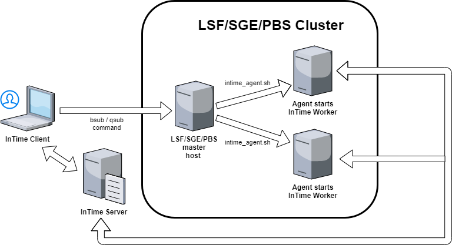
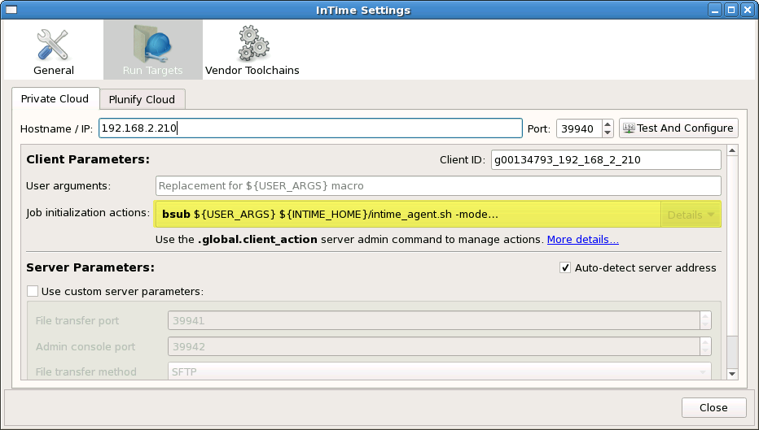

InTime Configuration for LSF/SGE/PBS 
==========================================

InTime supports 3 workload management platforms - LSF, SGE and PBS. This section explains how to start an InTime Agent on these platforms. 

!!! important
    Before you proceed with this section, please ensure that you have completed the configuration of the build environment, working directory as specified [here](configuration_enterprise/#configure-build-environment).

Below is an overview of how InTime, InTime Server interacts with these platforms.



## LSF/SGE/PBS Configuration

For these platforms, the respective job submission commands are:

1.  LSF which uses `bsub`.
2.  SGE which uses `qsub`.
3.  Torque PBS which also uses `qsub` but with different arguments.

Environment variables like USER\_ARGS, INTIME\_HOME, INTIME\_SERVER, etc. are referenced in the following examples. Some of them are specified automatically and you *only* need to configure `USER_ARGS`.

The paragraphs below the command examples explains these variables.

For LSF:- (all on the same line) :

    bsub ${USER_ARGS} ${INTIME_HOME}/intime_agent.sh -mode background -platform minimal 
    -ip ${INTIME_SERVER} -comport ${INTIME_PORT} -remote_job ${REMOTE_JOB_ID} 
    -max_runs ${AGENT_MAX_RUNS} -no_agent_limit 

For SGE:- (all on the same line) :

    qsub ${USER_ARGS} -sync n -S /bin/sh ${INTIME_HOME}/intime_agent.sh
        -intime_home /opt/tools/intime -mode background -platform minimal 
    -ip ${INTIME_SERVER} -comport ${INTIME_PORT} -remote_job ${REMOTE_JOB_ID} 
    -max_runs ${AGENT_MAX_RUNS} -no_agent_limit 

For PBS:- (all on the same line, no space after commas) :

    qsub ${INTIME_HOME}/intime_agent.pbs -v INTIME_HOME=${INTIME_HOME},
        IP=${INTIME_SERVER},COMPORT=${INTIME_PORT},REMOTE_JOB=${REMOTE_JOB_ID},
        MAX_RUNS=${AGENT_MAX_RUNS}

Each of these commands submits a request to start an InTime Agent in the LSF / SGE / PBS queue. Once the request is serviced, an Agent will start on the respective machine and the InTime Server will be able to assign builds to it. This is basically all that you need to use InTime with a job management system

You may have to specify additional arguments that are specific to your environment. Please discuss with your IT administrator if necessary.

This is an explanation of the arguments used in the commands

-   `bsub` or `qsub` arguments specific to your environment *must* be inserted before the `intime_agent.sh` command, using the
    `${USER_ARGS}` environment variable.

-   PBS uses a supplied script called intime\_agent.pbs to start jobs. The arguments used are similar to LSF and SGE except that you do
    not need to specify `${USER_ARGS}`.

-   Each command contains macros in the form of `${<MACRO_NAME>}` which is resolved by InTime before executing the command. The
    following macros are available:
>
    INTIME_SERVER     : The InTime Server IP/hostname.
    INTIME_PORT       : The InTime Server communication port.
    REMOTE_JOB_ID     : The remote job ID of the current job.
    LOCAL_JOB_ID      : The local job ID of the current job.
    JOB_DIR           : The local working directory of the current job.         
    USER_HOME         : The user's home path on the InTime Client machine.
    INTIME_HOME       : The InTime installation directory.
    PROJECT_DIR       : The current project's directory.
    PROJECT_NAME      : The current project's name.
    USER_ARGS         : Any user specific arguments (queue names, priorities etc.)
    AGENT_MAX_RUNS    : Max runs for agent when action's trigger is "Concurrent Runs".
    REVISION_NAME     : The revision name when action's trigger is "Revision".
>
-   In addition, there are additional arguments for the InTime Agent which gives you more control over its behavior; Specifically:
>
    -no_agent_limit
    Allows multiple Agents run on the same machine. 
    By default only one Agent is allowed to run on a single machine. 
>
    -max_runs <count>
    Limits this Agent to the specified number of runs. 
    When the runs are done, the Agent will terminate itself.
>
    -remote_job <remote_job_id>
    Restricts this Agent to service a particular build job. The InTime Server will 
    only assign jobs which have the specified ID to this Agent. 
>

These arguments make the agents very flexible and adaptable to many different environments, but also can make the configuration process a
little daunting for the user.

In the example above, the spawned Agent will only service the specified build job and will automatically terminate as soon as the required
number of builds have completed.


### Configure Agents for LSF

Open an InTime Server Admin Console and run the `.global.set.client_action` command. The example below shows how to specify your `bsub` command.  

```bash
user> .admin
admin> .global.set.client_action

Enter action type, use .end to exit session.
Types: ('1' for Job Initialization) [1]

admin.type> 1

Enter Operating System, use .end to exit session.
Operating System: ('1' for Linux, '2' for Windows) [1]

admin.os> 1

Enter script to execute, use .end to exit session.

admin.exec> bsub

(Optional) Enter script arguments, use .end to exit session.

admin.args> ${USER_ARGS} ${INTIME_HOME}/intime_agent.sh -mode background 
-platform minimal -ip ${INTIME_SERVER} -comport ${INTIME_PORT} 
-remote_job ${REMOTE_JOB_ID} -max_runs ${AGENT_MAX_RUNS} -no_agent_limit

Enter trigger based on the type, use .end to exit session.
Triggers: ('1' for Single, '2' for Revision, '3' for Concurrent Runs) [3]

admin.trigger> 3

(Optional) Enter working directory, use .end to exit session.

admin.directory>

Enter option to abort a job if it fails, use .end to exit session.
Abort job if fail: ('1' for yes, '2' for no) [1]

admin.option> 1

Enter a number for the order in which the script will be executed, 0 first to be executed, use 
.end to exit session. [4]

admin.order> 0

Action Type       : init
Operating System  : linux
Execute           : bsub
Arguments         : ${USER_ARGS} ${INTIME_HOME}/intime_agent.sh -mode background 
-platform minimal -ip ${INTIME_SERVER} -comport ${INTIME_PORT} 
-remote_job ${REMOTE_JOB_ID} -max_runs ${AGENT_MAX_RUNS} -no_agent_limit
Trigger type      : con_runs
Working Directory :
Abort job if fail : 1
Order             : 0

Save to session? ('y' for Yes or 'n' for No) [y]

admin.confirm> y

Add more client settings? ('y' for Yes or 'n' for No) [y]

admin.confirm> n
admin>
```

### Configure Agents for SGE

Open a Server Admin Console and run the `.global.set.client_action` command. The example below shows how
to specify your `qsub` command.

!!! warning 
    Do *not* use the -terse argument, and note that InTime looks for the return string, "Your job X ("intime_agent.sh") has been submitted" in order to verify successful job submission. With the -sync n argument, qsub exits with exit code 0 as soon as the job is submitted successfully. In the example below, InTime is installed at /opt/tools/intime.

```bash
user>.admin
admin>.global.set.client_action

Enter action type, use .end to exit session.
Types: ('1' for Job Initialization) [1]

admin.type>1

Enter Operating System, use .end to exit session.
Operating System: ('1' for Linux, '2' for Windows) [1]

admin.os>1

Enter script to execute, use .end to exit session.

admin.exec>qsub

(Optional) Enter script arguments, use .end to exit session.

admin.args${USER_ARGS} -sync n -S /bin/sh ${INTIME_HOME}/intime_agent.sh
    -intime_home /opt/tools/intime -mode background 
-platform minimal -ip ${INTIME_SERVER} -comport ${INTIME_PORT} 
-remote_job ${REMOTE_JOB_ID} -max_runs ${AGENT_MAX_RUNS} -no_agent_limit

Enter trigger based on the type, use .end to exit session.
Triggers: ('1' for Single, '2' for Revision, '3' for Concurrent Runs) [3]

admin.trigger>3

(Optional) Enter working directory, use .end to exit session.

admin.directory>

Enter option to abort a job if it fails, use .end to exit session.
Abort job if fail: ('1' for yes, '2' for no) [1]

admin.option>1

Enter a number for the order in which the script will be executed, 0 first to be executed, use 
.end to exit session. [4]

admin.order>0

Action Type       : init
Operating System  : linux
Execute           : qsub
Arguments         : ${USER_ARGS} -sync n -S /bin/sh ${INTIME_HOME}/intime_agent.sh
    -intime_home /opt/tools/intime
-mode background -platform minimal -ip ${INTIME_SERVER} -comport ${INTIME_PORT} 
-remote_job ${REMOTE_JOB_ID} -max_runs ${AGENT_MAX_RUNS} -no_agent_limit
Trigger type      : con_runs
Working Directory :
Abort job if fail : 1
Order             : 0

Save to session? ('y' for Yes or 'n' for No) [y]

admin.confirm>y

Add more client settings? ('y' for Yes or 'n' for No) [y]

admin.confirm>n
admin>
```

### Configure Agents for PBS

Open the Server Admin Console and run the `.global.set.client_action` command. The example below shows how to specify your `qsub` command.

```bash
user>.admin
admin>.global.set.client_action

Enter action type, use .end to exit session.
Types: ('1' for Job Initialization) [1]

admin.type>1

Enter Operating System, use .end to exit session.
Operating System: ('1' for Linux, '2' for Windows) [1]

admin.os>1

Enter script to execute, use .end to exit session.

admin.exec>qsub

(Optional) Enter script arguments, use .end to exit session.

admin.args${INTIME_HOME}/intime_agent.pbs -v INTIME_HOME=${INTIME_HOME},
IP=${INTIME_SERVER},COMPORT=${INTIME_PORT},REMOTE_JOB=${REMOTE_JOB_ID},
MAX_RUNS=${AGENT_MAX_RUNS}

Enter trigger based on the type, use .end to exit session.
Triggers: ('1' for Single, '2' for Revision, '3' for Concurrent Runs) [3]

admin.trigger>3

(Optional) Enter working directory, use .end to exit session.

admin.directory>

Enter option to abort a job if it fails, use .end to exit session.
Abort job if fail: ('1' for yes, '2' for no) [1]

admin.option>1

Enter a number where script will be executed, 0 first to be executed, use 
.end to exit session. [4]

admin.order>0

Action Type       : init
Operating System  : linux
Execute           : qsub
Arguments         : ${INTIME_HOME}/intime_agent.pbs -v INTIME_HOME=${INTIME_HOME},
IP=${INTIME_SERVER},COMPORT=${INTIME_PORT},REMOTE_JOB=${REMOTE_JOB_ID},
MAX_RUNS=${AGENT_MAX_RUNS}
Trigger type      : con_runs
Working Directory :
Abort job if fail : 1
Order             : 0

Save to session? ('y' for Yes or 'n' for No) [y]

admin.confirm>y

Add more client settings? ('y' for Yes or 'n' for No) [y]

admin.confirm>n
admin>
```

## Verify Agent Status

Use the `.global.client_action` command in the Server Admin Console to check the status of the commands executed. 

In the Server Admin Console, type `.status` to list active Agents.
```text
user>.status
+-----+--------------------+-------+--------+--------+-------+--------+-----------------+
| NO. | CLIENTID           | JOBID | USERID | STATUS | ALIVE | B.LIST | LAST_HEARTBEAT  |
+-----+--------------------+-------+--------+--------+-------+--------+-----------------+
| 1   | user_192_168_2_211 | 2915  | user   | BUSY   | YES   | NO     | 08:43 (00m:48s) |
| 2   | user_192_168_2_211 | 2915  | user   | BUSY   | YES   | NO     | 08:43 (00m:36s) |
+-----+--------------------+-------+--------+--------+-------+--------+-----------------+
2 rows (0.01 sec), 2014-12-10 08:44:14
```

Next, use `.toolchain` to verify if all Agents successfully received and applied the FPGA tools' information from the Server.
```text
user>.toolchain
+-----+--------------------+-------+--------+--------+-------+--------+-----------+---------+
| NO. | CLIENTID           | JOBID | USERID | STATUS | ALIVE | VENDOR | TOOL      | VERSION |
+-----+--------------------+-------+--------+--------+-------+--------+-----------+---------+
| 1   | user_192_168_2_211 |       | user   | FREE   | YES   | ALTERA | QUARTUSII | 13.1.2  |
| 2   | user_192_168_2_212 |       | user   | FREE   | YES   | ALTERA | QUARTUSII | 13.1.2  |
+-----+--------------------+-------+--------+--------+-------+--------+-----------+---------+
2 rows (0.01 sec), 2014-12-10 08:48:41
```
Agents can be terminated using the `.intime.set.terminate` Admin Console command. See the [Private Cloud Console](private_cloud_administration.md) documentation for more information.

### Verifying Private Cloud Setup on the Client (LSF/SGE/PBS) 

Now that you have configured Agents to start dynamically, use the InTime Client to test your configuration.

Open the settings dialog using *File*, *Settings* and then selecting *Run Targets*. Under the *Private Cloud* tab, click on *Test And
Configure*. All commands configured in the Server will be listed in the sequence in which they will be executed, as shown in



Click the *Details* button next to each command to view more information about it.

## Submit a Test Job
Go to the [quick start](quickstart.md) to start a job.

