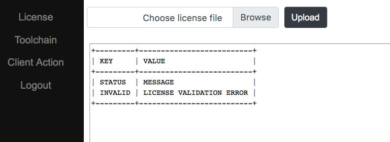

Configure InTime Server with a Web-based Portal
===============================================

InTime Server v2.6.10 introduces a new, more user-friendly Admin Portal feature. The InTime Server Admin Portal allows users to configure InTime Server settings from a web browser, making configuration faster and easier. In this guide we will take a look at the different configuration options available in the Admin Portal.

## Accessing the Admin Portal

For security reasons, by default the Portal is accessible only from the InTime Server machine and is inaccessible from other machines. To enable access from other machines, start InTime Server with the `-aclnolocal` option. 

You can then type <Intime Server IP Address>:39946/admin in your browser.

!!! tip
    The default port is 39946. This can be changed using the InTime Server -aclport option.

## Logging In

The username and password can be found in <InTime Server installation directory>/admin.txt. You can change the password in admin.txt. There is no need to restart the InTime Server after a change of password – changes take effect immediately.

## License Management

Upon logging in, you will be taken to the License Management page. This is where you can view or upload a new license to the InTime server. If you have started InTime Server without a license configured, this page will show a license validation error.

Choose the license file to upload by clicking on the ‘Browse’ button and proceed by clicking the ‘Upload File’ button. Note that you can only upload license files that have the file extension ‘.lic’. If the license is valid, a success message and the license details will appear.

If the license is invalid, an error message will show up, explaining what went wrong.

## Toolchain Management

The Toolchain Management page allows you to add, edit or remove your FPGA tools. At least one toolchain is required for InTime to work in Private Cloud mode. To access the Toolchain Management page, click the ‘Toolchain’ submenu. The resulting page will display a list of configured toolchains. If a tool’s path is accessible by the InTime Server, it will be displayed in green, otherwise in red. 

### Add Toolchain
To add a toolchain, click the ‘Add toolchain’ button. Fill in the necessary information and click ‘Add Toolchain’ to register it.

### Edit/Delete Toolchain
To edit a registered toolchain, click the ‘Edit’ link and modify the details accordingly. Click ‘Submit’ to confirm. To delete a registered toolchain, simply click ‘Delete’.

## LSF / SGE / PBS Configuration - Client Actions

To use InTime together with LSF (Load Sharing Facility), SGE (Sun Grid Engine) or PBS, additional commands – also known as “Client Actions” – are required. To access the Client Actions page, click the ‘Client Action’ submenu. The page will display a list of registered Client Actions.

### Add New Client Action

To add a Client Action, click the ‘Add Action’ button.

Follow the instructions below to add "Client Actions" for different environments.

#### LSF
    Action Type: Init
    Execute: bsub
    Arguments: ${USER_ARGS} ${INTIME_HOME}/intime_agent.sh -mode background -platform minimal -ip ${INTIME_SERVER} -comport ${INTIME_PORT} -remote_job ${REMOTE_JOB_ID} -max_runs ${AGENT_MAX_RUNS} -no_agent_limit
    Trigger type: Concurrent runs
    Abort job if fail: Yes

#### SGE
    Action Type: Init
    Execute: qsub
    Arguments:  ${USER_ARGS} -sync n -S /bin/sh ${INTIME_HOME}/intime_agent.sh -intime_home /opt/tools/intime -mode background -platform minimal -ip ${INTIME_SERVER} -comport ${INTIME_PORT} -remote_job ${REMOTE_JOB_ID} -max_runs ${AGENT_MAX_RUNS} -no_agent_limit
    Trigger type: Concurrent runs
    Abort job if fail: Yes

#### PBS
    Action Type: Init
    Execute: qsub
    Arguments:  ${INTIME_HOME}/intime_agent.pbs -v INTIME_HOME=${INTIME_HOME}, IP=${INTIME_SERVER},COMPORT=${INTIME_PORT},REMOTE_JOB=${REMOTE_JOB_ID}, MAX_RUNS=${AGENT_MAX_RUNS}
    Trigger type: Concurrent runs
    Abort job if fail: Yes

### Edit Client Action
To edit a registered Client Action, click the ‘Edit’ and modify the corresponding toolchain. Click ‘Submit’ to confirm.

To delete a registered Client Action, simply click ‘Delete’.

