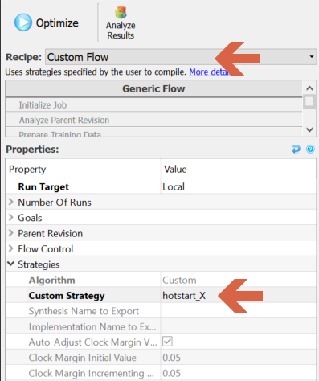

How to use custom strategies
=============================

Custom Strategies are strategies that are generated from external sources which can be run in InTime. Note that this feature is only
available from 1.3.2 onwwards.


## Prepare Strategy File

The strategy file needs to be in a json format, as shown in the example below
```json
{
"custom_1": [ 
    { "name": "ALM_REGISTER_PACKING_EFFORT", "step": "unknown", "value": "HIGH" },
    { "name": "FITTER_AGGRESSIVE_ROUTABILITY_OPTIMIZATION", "step": "unknown", "value": "ALWAYS" },
    { "name": "OPTIMIZATION_MODE", "step": "unknown", "value": "HIGH POWER EFFORT" },
    { "name": "OPTIMIZATION_TECHNIQUE", "step": "unknown", "value": "BALANCED" },
    { "name": "PHYSICAL_SYNTHESIS_COMBO_LOGIC", "step": "unknown", "value": "OFF" },
    { "name": "PHYSICAL_SYNTHESIS_COMBO_LOGIC_FOR_AREA", "step": "unknown", "value": "OFF" },
    { "name": "PHYSICAL_SYNTHESIS_REGISTER_DUPLICATION", "step": "unknown", "value": "OFF" },
    { "name": "PHYSICAL_SYNTHESIS_REGISTER_RETIMING", "step": "unknown", "value": "OFF" },
    { "name": "QII_AUTO_PACKED_REGISTERS", "step": "unknown", "value": "OFF" },
    { "name": "ROUTER_LCELL_INSERTION_AND_LOGIC_DUPLICATION", "step": "unknown", "value": "OFF" }
  ]
}
```
The example shows the strategy settings for a Quartus tool. "custom_1" is the strategy name.
The settings are expressed in a "name", "step" and "value" format. The "name" should be a valid setting name and the "value" is the acceptable value for the setting. "Step" can be left as "unknown".

## Run a Custom Strategy

1. To run a custom strategy, switch to the "Custom Flow" recipe

2. Prepare your strategy file. In this example we named it "HotStart_X.strategy".

3. Copy the strategy file into the project directory at the same level as the project file, i.e. XPR, DCP, QPR

4. In the "Flow Properties", there is a "Custom Strategy" field under the "Strategies" group. Specify the file name without the extension as the value, e.g. hotstart_X


5. Click "Optimize". InTime will run as normal. It will only generate the strategies specified in your strategy file.
