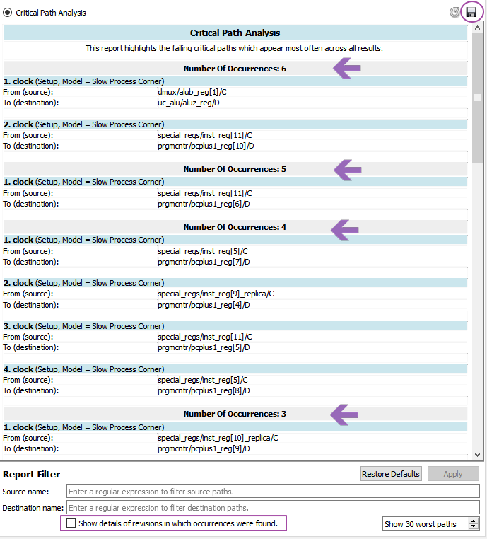
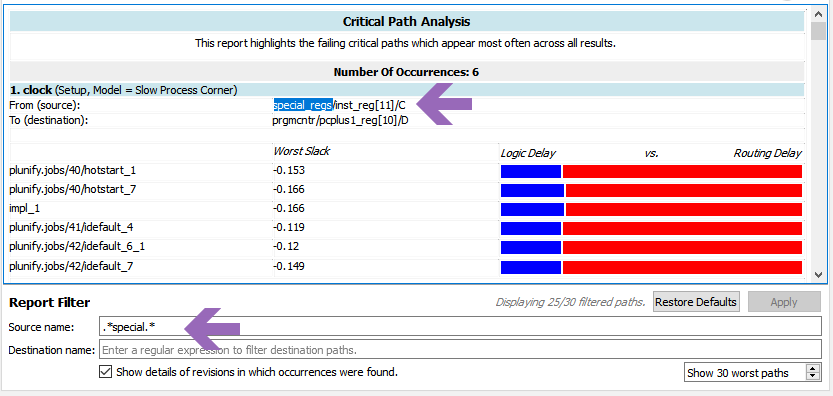

Design Analysis 
=========================

## Critical Path Analysis

The Design Analysis tab provides insights on the critical paths in the design. The goal is to highlight the occurences and details of the same critical path in the multiple results. By aggregating the analysis, the user can use this to identify and prioritize which critical path to fix in the design.

 

## How to use 

### Total Occurences
Use the total occurences as an indication as to which paths are affecting most of your results. Prioritize the any changes to these paths. In the screenshot, there are 6 occurences in 4 jobs that were included in the analysis. The source and destination of the path, and each strategy and its worst slack can be toggled to be shown or hidden.

 

!!! tip "Save results to PDF"
    If you want to do some external datamining, you also save the results to a pdf by clicking on the "Save" button at the top right.
    

### Logic versus Routing Delay

The colours bars on the right represent the ratio between logic delay and routing delay. Red means that it has excessive delay. An easy way to interpret this is as follows

Type        | Colour | Description | Recommendations
-----       | - | - | -
Logic Delay |  | Logic delay is too high | Optimize synthesis - Run InTime Default recipe or use settings filters to explore more synthesis settings
Logic Delay |  | Logic delay is within expected threshold | No action required.
Routing Delay |  | Routing delay is within expected threshold |  No action required.
Routing Delay |  | Routing delay is too high. | Optimize placement - Use hotstart, placement exploration.  Use settings filters to whitelist routing settings to explore only routing.


### Report Filters

To filter specific source or destination paths, you can specify the regular expressions in the report filters. For example, ```.*special.*``` will return the paths with the word **special** in it.

 

To clear the filters, just click on the "Restore Defaults" button.