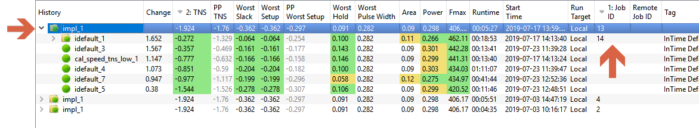
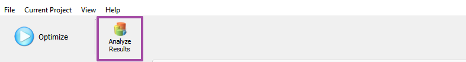

Navigating the InTime GUI 
=========================

InTime GUI
----------

The InTime GUI uses a single "**Optimize**" button in the top left corner to start and stop a build..
 

The left side focuses on the active [recipe](recipes.md) and the InTime flow. The center-right portion focuses on the current project and the section below that provides tabbed panels of details about the active recipe, current project and InTime status.

## Project History

The project history keeps track of all InTime runs on a **per project** basis. InTime updates this history while a recipe is running to give continuous updates on which strategies are run as well as the outcomes. Each round is given a job ID and denoted with a folder icon. If there are multiple rounds, each round is organized in a tree format. To expand a round, simply click on the arrow icon next to the round. Note that the best result (e.g. TNS) in each round act as the "**parent revision**" for the next round. The highlighted row in the image below is called the "**root revision**".

!!! Info "What is parent revision?"
    Each round has a "**parent revision**" which is the point of reference for generating strategies and determining result improvements. Read more under [**flow properties**](flow_properties.md).

### Project History Columns 

The default visible columns in the project history 

Column Name | Description
----------- | ------------- 
History | This is the strategy / revision name, usually named after the recipe name.
Change | TNS difference between the root revision and the current strategy
TNS | Total Negative Slack of the current strategy
PP TNS | Post placement TNS timing estimate.
Worst Slack | Worst Slack out of the 3 reported slacks
Worst Setup | Worst Setup Slack 
PP Worst Setup | Post placement Worst Setup timing estimate
Worst Hold | Worst Hold Slack reported by the FPGA tool
Worst Pulse Width | Worst Pulse Width reported by the FPGA tool
Area | Utilization (%) reported by the FPGA tool
Power | Power reported by the FPGA tool
FMax | FMax based on the fastest clock in the design (autoamtically selected by InTime)
Start Time | Start Time of the strategy in YYYY-MM-DD HH:MM:SS
Run Target | Local, Private Cloud or Public Cloud
Job ID | Job ID assigned to this round based on this local machine
Remote Job ID | Unique Job ID assigned to this round assigned by InTime Server
Tag | Editable placeholder for remarks. Default value is based on recipe detatils. Click on it to edit.

To hide a column, go to **View** -> **Select Columns** and uncheck the column to hide it.

### Project History Icons

In the GUI, you will come across a few icons in the project history to indicate the state of strategies.

Icon | Description
------------ | ------------- 
 | Strategy has not started yet or stopped.
 | Strategy is currently being run locally.
 | Strategy is currently being run on a remote target.
 | Strategy was completed successfully but the design goal was not met.
 | Job folder with strategies. Click to expand folder.
 | Strategy was completed successfully and the design goal was met.
 | Strategy completed but with unrouted nets.
 | Strategy failed.
 | Maximum run time exceeded.
 | Strategy set as a **parent revision** 

## Select Recipes
Recipes are different optimization approaches. Refer to the [recipes](recipes.md) page for more information.

## Flow Properties

On the bottom left is the **Flow Properties**. Flow properties specify how you want to control your builds, e.g number of rounds, maximum runtime. Refer to the [flow properties](flow_properties.md) page for details of each property.

## Session Log & Issues

Right at the bottom, this tab displays the InTime session log. It will show the build status and errors (if any) that InTime encounters when it is running.

The Issue tab filters the session log and displays "Warnings" and "Errors" only.

## Selected Results

When you click on a result, the details are display in the **Selected Results** tab. There are 2 views, a results view and a settings view. This is controled with the radio buttons on the right.

To learn more about working and managing InTime results, refer to the [review results](results.md) page for more explanations.

## Tcl Console

A Tcl console in the GUI to execute Tcl commands. 
 

For example, to get an overview of a project's history, just type `project history`. 

    plunify> project history

        --------------------------------------------------------------------
        | Job ID | Strategy       | Improvement | Timing Score | RunState  |
        --------------------------------------------------------------------
        | 2049   | /eight_bit_uc  |             | 10.407       | RunDone   |
        | 2049   |   |-educated_1 | -9.294      | 1.113        | RunDone   |
        | 2050   | /eight_bit_uc  |             | 10.407       | RunDone   |
        | 2050   |   |-educated_1 | -3.422      | 6.985        | RunDone   |
        | 2050   |   |-educated_2 | -7.595      | 2.812        | RunDone   |
        | 2050   |   |-educated_3 | -5.792      | 4.615        | RunDone   |
        --------------------------------------------------------------------

A Tcl command reference guide can be found [here](https://support.plunify.com/en/doc/intime-doc/tcl-command-reference/#26315).

## Analyze Results
Additional analysis features can be access by clicking on the button "Analyze Result" in the InTime GUI. 
 
Refer to the [analyze results](analyze.md) page for detailed explanation.
