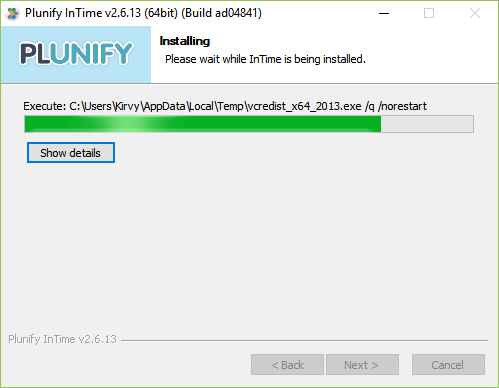

InTime Installation (Single Seat)
=================================

InTime can run on a single or multiple servers. For multiple computers, it will require a component called InTime Server. Please refer to the [multiple seats](installation_enterprise.md) installation guide.

!!! Note "What is InTime Agent" 
	With every InTime installation, you will also see an application called "InTime Agent" that is also installed. This is required when InTime is ran over multiple machines at the same time.

## Operating System Requirements

-   64-bit architectures only
-   Windows 7 above / Ubuntu 12.04 and above / RedHat Enterprise 5 and above compatible
-   Other versions are supported upon request.

## Linux Installation

1. Download the installer from [https://cloud.plunify.com/downloads](https://cloud.plunify.com/downloads).

2. Open a command-line terminal. Create the folder to install InTime.
```bash
$ mkdir -p ~/plunify/intime
```

3. Navigate to the installation folder.
```bash
$ cd ~/plunify/intime
```

4. Login as the appropriate user and set user execute permissions for intime\_v\<version\>\_64bit\_linux.sh. Run the installer script.
```bash
~/plunify/intime $  chmod u+x intime_v<version>_64bit_linux.sh

~/plunify/intime $ sh ~/Downloads/intime_v2,7_64bit_linux.sh
Verifying archive integrity... All good.
Uncompressing Plunify InTime version 2.7.0...................................
.............................................................................
.............................................................................
.............................................................................
```

5. The script extracts installation files and presents a licensing agreement. Follow the onscreen instructions to accept and proceed.

6. A prompt to install default modules will appear. Hit <Enter\> to install all the options.
```bash
--------------------------------------------------------------------------------
Accept the terms of the Plunify End-User Licensing Agreement ('y' for Yes or 'n' for No)? y

Thank you, proceeding with installation...

Install default modules (Recommended)? ('y' for Yes or 'n' for No) [y] y
Installing defaults...


Installing 64-bit JRE...

InTime installation complete.
```

    !!! note "Three options for modules"  
        "**Local**" - on a standalone PC where InTime is installed.  
        "**Private Cloud**" - Over multiple computers in the user's network.  
        "**Plunify Cloud**" - Using Plunify-managed cloud computing resources.  
        **Local** is always installed, but the rest are optional. See `run_targets` under Flow Properties for more information on the different options.

7. Finally, the installer creates InTime-related shortcuts on the user's desktop.

---

## Windows Installation

1. Download the Linux installer from [https://cloud.plunify.com/downloads](https://cloud.plunify.com/downloads).

2. Run the installer by double-clicking the downloaded file. The installer wizard contains the following pages which guide you through the installation process. Just follow the process below.





