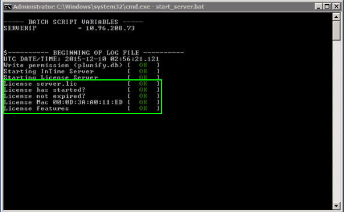
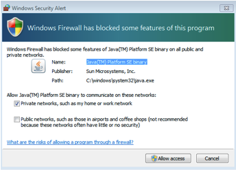

InTime Installation (Multiple Seats)
====================================

To run InTime over multiple seats, the installation of the following components is required 
1. InTime (and License) Server, to coordinate and distribute the different builds  
2. InTime client (we called them "worker") installed on these new machines.  


## InTime/License Server

The InTime Server acts as a job scheduler/manager and license manager when InTime is running on multiple machines at the same time. A License Server is also packaged together and is a service to allow InTime to use floating licenses. 
These two services are installed by default during installation when the default options are selected.

### Requirements

- Operating System: 64-bit architectures only. Windows 7 above / Ubuntu 12.04 and above / RedHat Enterprise 5 and above compatible
- A minimum of 40GB free space is required for InTime Server.
- *Static* IP address to communicate with InTime workers.
- Network ports 
    - Ports 39940, 39941 for workers to communicate with InTime Server.
    - Port 39942 for the administrative console.

    !!! note
        Java is required but InTime will install its own Java 1.8.0 JDK.


### Linux Installation

1. Download the installer from [https://cloud.plunify.com/downloads](https://cloud.plunify.com/downloads).

2. Login as a privileged user and set user execute permissions for "intimeserver_v2.7_64bit_linux.sh". In this example, the user is "*cadadmin*", and the installation directory is "/home/cadadmin/intimeserver/".  
```bash
$ pwd
/home/cadadmin/intimeserver/  

$ chmod u+x intimeserver_v2.7_64bit_linux.sh
```

    !!! warning
        As a security precaution, we do not allow the "root" account to install and run the InTime Server. It is not recommended to use the root to install or run any 3rd party applications.

3. Run the installer file. Use the default options for full installation. For those user who are planning
to migrate existing database and configurations from an earlier version, enter the same directory of the ealier version for the installer to overwrite.
```bash
$ ./intimeserver_v<version>_64bit_linux.sh

Verifying archive integrity... All good.
Uncompressing Plunify InTime Server version 2.6.10 (Build ccc1cfd).........................
Installation selection ('1' Full installation InTime Server/License Server, 
'2' License Server only, '3' InTime Server only) [1] 1

Installing InTime Server/License Server
Install for which database? ('1' for SQLite or '2' for MySQL) [1] 1

Install support for SQLite
Do you want to clean up(remove) the installer ('y' for Yes or 'n' for No) [n] n

Use jvm options default(1), minimal(2), optimal(3) (Blank is default) 1

If you plan to migrate configuration and database from an earlier version of InTime Server 
installed on another directory, key in the directory to migrate. If you are installing 
over the existing directory or this is the first time you install InTime Server, 
press enter to skip [enter]: 

Skipping.
InTime Server/License Server installation OK.

$
```

    !!! tip "Install License Server and InTime Server on 2 different servers" 
        To install License Server and InTime Server on 2 or more servers, refer to this [webpage](https://support.plunify.com/en/knowledgebase/how-to-have-intime-server-and-license-server-custom-installation/) for more information.

4. Install license And start Server. Put the license file, e.g. *server.lic*, into `/home/cadadmin/intimeserver/` and launch the InTime Server. To launch the InTime Server, run the script `./start_server.sh`.
```bash
$ pwd
/home/cadadmin/intimeserver
$ ./start_server.sh 

----- SHELL SCRIPT VARIABLES -----
PID [OLD]         = 29016 
SERVERIP 1        = 192.168.2.100


$---------- BEGINNING OF LOG FILE ----------
UTC DATE/TIME: 2015-12-15 02:32:01.269


$---------- BEGINNING OF LOG FILE ----------
UTC DATE/TIME: 2015-12-15 02:32:01.269
Write permission (plunify.db) [  OK  ]
JDBC (plunify.db)             [  OK  ]
JDBC (intimeruns.h2.db)       [  OK  ]
Starting InTime Server        [  OK  ]
Starting License Server       [  OK  ]
Starting ACL Server           [  OK  ]
License server.lic            [  OK  ]
License has started?          [  OK  ]
License not expired?          [  OK  ]
License Mac 08:00:27:70:A5:E2 [  OK  ]
License features              [  OK  ]

Admin portal can be accessed at http://localhost:39946/admin

$ 
```

    !!! tip
        To start/restart the Server at a later time, just run `./start_server.sh` again. To shut down the server run
        `./start_server.sh -stop`


5. Check the InTime Server's status.
```bash
$ ps -ef|grep java
intime    5700     1  2 07:16 pts/3    00:00:03 /home/caadmin/intimeserver/./jdk/bin/java -Xms512m -Xmx1024m -server -Dlogback.configurationFile=/home/caadmin/intimeserver/./conf/logback.xml -DINTIMESERVER_HOME=/home/caadmin/intimeserver/. -classpath /home/caadmin/intimeserver/./intimeserver.jar:/home/caadmin/intimeserver/./lib/* com.plunify.main.InTimeServer -directory /home/caadmin/intimeserver/./plunify_server -licensefile /home/caadmin/intimeserver/./server.lic -log_level info
```

    !!! tip "Automatically Start Server (Optional)"
        To automatically start the InTime Server when a machine boots up, add the following line to `/etc/rc.local`.
        $ vi /etc/rc.local
        /bin/su -s /bin/bash -c '/home/cadadmin/intimeserver/start_server.sh' cadadmin


--- 

### Windows Installation

1. Download the (windows) installer from [https://cloud.plunify.com/downloads](https://cloud.plunify.com/downloads).

2. Run the installer by double-clicking it on the machine designated as the InTime server. 
Select "Full Installation" to install the default. InTime Server will be installed in the default directory `C:\intimeserver`. The installer will attempt to overwrite earlier version of libraries and files, do make sure a backup to this directory before installing.  

3. Request a license from Plunify by providing the MAC address of the InTime Server machine. After receiving the license file, for example, `server.lic`, place it in `C:\intimeserver`.  

4. Open a command prompt and navigate to `C:\intimeserver`. To launch InTime Server, run the `start_server.bat` script.  

    !!! tip "Stop and restart"
        To shut down the server run `start_server.bat -stop`. To start/restart the Server at a later time, just run `start_server.bat` again in another shell. 

    Please ensure that you see the license acceptance message as shown below

    

    A Windows Security Alert may pop up indicating that a Java binary is running. Click "Allow access" as shown below

    


## Install InTime Agent (Worker)

Do this for every machine that uses InTime or just once in a shared folder.
The installation process is the same as installing InTime for a single seat. Please refer to the [Single Seat](installation_basic.md) installation guide for the detailed instructions.

