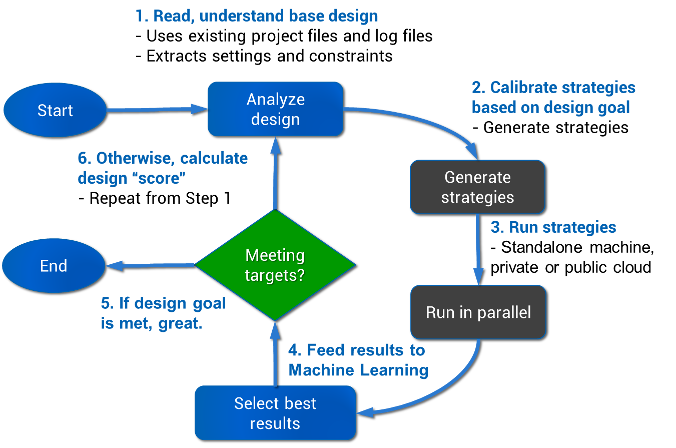
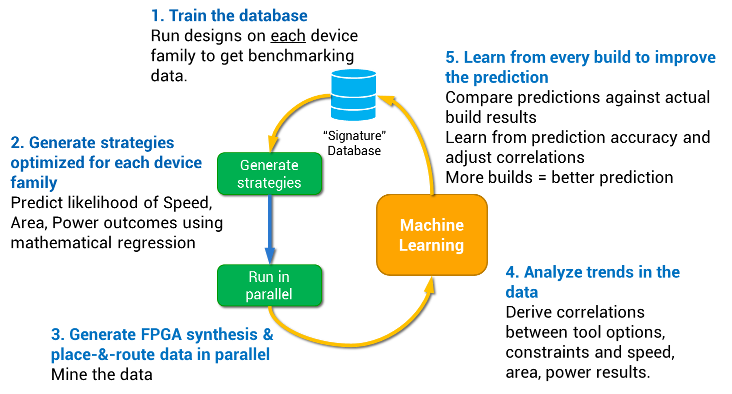
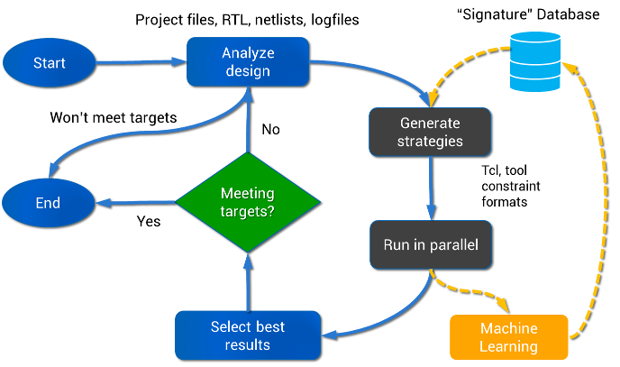

The InTime Flow
===============

A typical InTime flow is shown below.

The flow's starting point is an FPGA project created separately in an FPGA vendor tool (Vivado/Qaurtus) or a generic build script such as a non-project mode script.

1. Analyze Design
----------------------

When InTime starts, it detects existing synthesis and place-and-route results for the active revision/run (also known as the
**default revision**). 

If results are not available the user will be prompted to let InTime build the active revision/run before proceeding. The default revision then becomes the **parent revision** of the strategy evaluation step. Using the parent revision, InTime generates strategies which are optimized for the design.

2. Strategy Generation & Learning
---------------------------------------

When InTime generates strategies, it uses built-in knowledge that is optimized for the design. This knowledge leads to strategies with
higher probabilities of improving the design's performance in order to meet design goals. Below shows how this process works and how it becomes smarter and better.

3. Bringing It Together
--------------------

The integrated flow diagram shows how strategy generation ties into the tool flow, providing a clearer picture of how the full InTime flow works.

Once all strategy results have been evaluated, InTime determines if the design goal and targets have been met. If so, InTime has succeeded. If
not, a next iteration of the flow will be started using the best result of the previous iteration as the basis (referred to as the *parent
revision* throughout the documentation). 

To cater to the needs of a wide range of situations and applications, there are different [recipes](recipes.md) available in InTime. These recipes may work on different aspects of the design such as, e.g. syntheis, incremental optimization, tackling high fanout, placement randomizations and even floorplanning.
