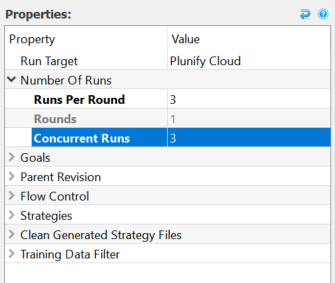
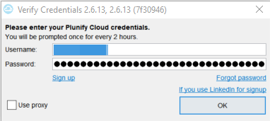
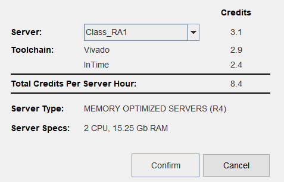
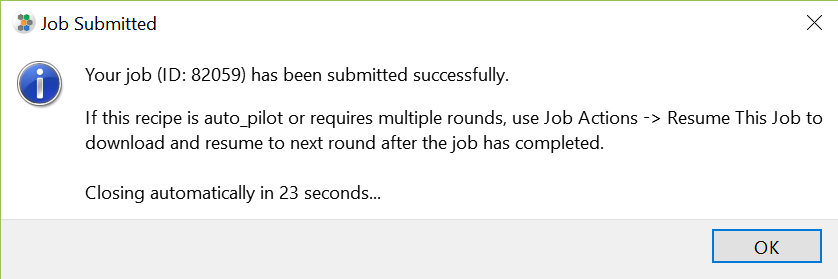
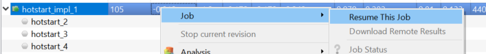

Using Plunify Cloud
===================

The Plunify cloud platform enables running of strategies using the massive computing power available by the public cloud platform. 

## Plunify Credits & Account
The Plunify cloud works on a credit based, pre-paid, pay-per minute model.

A Plunify user account is required in order to use the Plunify cloud. When submitting a Plunify cloud job, InTime will prompt for the user credentials of the account. Once authenticated,the number of credits linked to the account will be checked and if sufficient credits are available for the job, InTime will submit the job. '

For more information on how to buy credits as well as credit pricing, please refer to [https://cloud.plunify.com/](https://cloud.plunify.com/).

## Running a Plunify Cloud job

??? tip "Watch Plunify Cloud Video Tutorial" 
	Here is a video tutorial on how to use Plunify Cloud.
	<iframe width="963" height="394" src="https://www.youtube.com/embed/3PvMQmBX4L4" frameborder="0" allow="accelerometer; autoplay; encrypted-media; gyroscope; picture-in-picture" allowfullscreen></iframe>

	Refer to 
	https://support.plunify.com/en/documentation/submit-intime-runs-to-plunify-cloud/

1. To build on the cloud, change the `Run Target` in your Flow Properties to "Plunify Cloud".
.

	!!! note
		There is no concurrent runs limit on the cloud, whether it is 1 or 100. Always set this to be equal to the number of "Runs Per Round" to get results faster. There is no difference in credits consumed as well.

2. A prompt will appear asking for your credentials
  

3. After authenticating the credentials, pick a server. Note that different regions offer [different](https://cloud.plunify.com/faq#what_are_the_available_server_machine_types_for_each_cloud_region) type of servers. Different servers will consume different amount of credits due to difference in CPU and RAM. For the full details, please refer to the [FAQ page](https://cloud.plunify.com/faq).
  

4. InTime will proceed to upload the files to Plunify Cloud. A job ID will be assigned when the uploading is done.
  

5. To download your results, just right-click on your job and select "resume this job".
  

