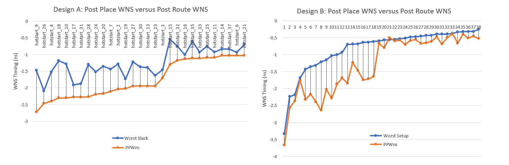
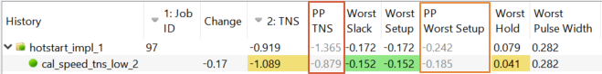
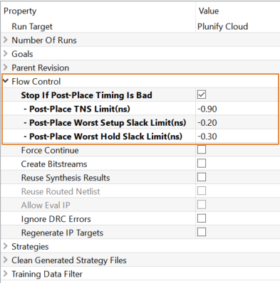

Reduce Run Time with Post Placement Estimates
=====================================================

Vivado provides post placement estimates for TNS and WNS. InTime tracks these estimate values as part of the builds. Users can make use of this feature, to set a cut off point and abandon builds with poor results and thus save time.  
(For more information about timing estimates, please refer to this [post](https://support.plunify.com/en/2018/03/20/how-to-reduce-your-build-time-by-50/).)

## Understanding Timing Estimates
Vivado reports the estimated timing summary as it went from synthesis to routing. The general rule of thumb is that it gets more accurate as it approaches routing (and less accurate the earlier it is). InTime identifies the post placement estimate, as the optimal point between accuracy and run time. In the chart below, the correlation between post placement estimate and the final timing after route for 2 different design is very high. 

## Where to find the estimates in InTime

InTime will display these values as "PPTNS" (Post Placement TNS) and "PPWNS" (Post Placement WNS). These numbers are shown in the results history panel.

By observing the values versus the final TNS or Slack timing, user can tell what is a good cut off point to abandon builds.

## Controlling the cut off point

The cut-off point can be configured in Flow Properties under "Flow Control".

Note that if any of the conditions are met for TNS, Worst Setup Slack **or** Worst Hold Slack, the build will be stopped.

The final result will show that the PPTNS and TNS are the same, and will be shown in a grey colour. 

