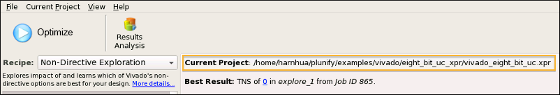
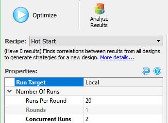
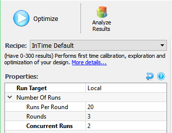
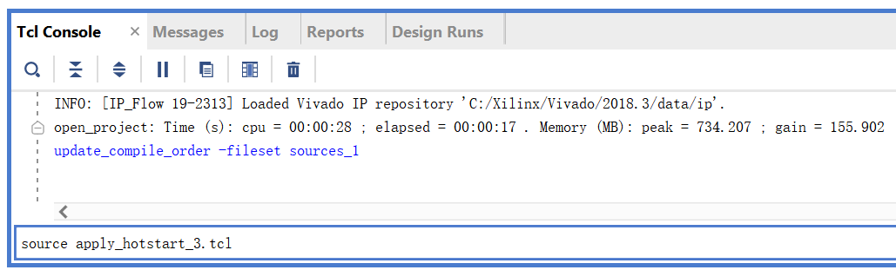

Quick Start for InTime 
=============================

This section is to enable new users to quickly get started with InTime GUI and optimize a project.


## 1. Start InTime

After installation, there are 2 ways to run InTime

* Desktop shortcuts for both InTime (and InTime Agent). Double-click the InTime desktop shortcut shown in below. 

	
 

* Open a command line terminal and enter the following command: 

    OS | Path
    ---|---
	**Linux** | ```<InTime installation directoryintime.sh```
	**Windows** | ```<InTime installation directoryintime.exe ```

## 2. Install the InTime license and configure FPGA tool settings 

Do not proceed if you haven't done that. Please refer to [configuration](configuration_basic.md).

## 3. Open An Example Project

Once the installed vendor tools have been registered, an example project can be used to explore InTime. Example projects are available for all supported toolchains.

Go to `File`, `Open Example Project` and it will show a list of possible projects based on your installed toolchain.  Select the right project and click to open your FPGA project. If successful, the project name will be displayed, similar to the one shown below
  


The next step is to select an InTime recipe. A recipe represents a compilation and learning flow. 

- For Vivado, proceed to this [section](#4a-vivado-flow).
- For ISE, proceed to this [section](#4b-ise-flow).
- For Quartus, proceed to this [section](#4c-quartus-flow).

## 4. Select A Recipe 

There are different recipes for different FPGA tools. Before starting the optimization, you must pick a recipe and configure the flow properties in InTime.

### 4a. Vivado Flow 

A list of available recipes for the Xilinx Vivado software is shown below. Click on the "Recipe" dropdown box to view this list.


For this quickstart, we will select a "**HotStart**" recipe. 

!!! Note "What is the "hotstart" recipe?"
    This recipe predicts the strategies using existing model within InTime. The purpose of this recipe is to quickly get to an optimal result within a shorter time frame.

    This recipe will generate 1 round of 20-40 compilations, using different implementation options. Even if it does not meet the required timing performance, the data generated establish a baseline of performance and serve a secondary purpose of becoming training data for future rounds. 

!!! tip
    For a new Vivado project, Plunify recommends starting with the *Hotstart* recipe.

**Configure the flow properties**

For the HotStart recipe, configure the following properties below.

* Run Target: **Local**
* Runs Per Round: **20** (You can go up to 47.)
* Rounds: **1** (This cannot be changed in HotStart.)
* Concurrent Runs: **2** (This can be higher based on your machine's resources.)



Once that is done, jump to the "[Start Optimization](quickstart.md#5-start-optimization)" section.

---

### 4b. ISE Flow

For ISE, we will select the "Default" recipe. This recipe generates different synthesis and implementation options. The purpose of this recipe is to learn about the dependencies between the design and the tool parameters through multiple rounds of compilations. Note that the list of recipes available for ISE is different from other toolchains.


**Configure the flow properties**

For the default recipe, configure the following properties below.

* Run Target: **Local**
* Runs Per Round: **20** (You can go up to 40.)
* Rounds: **3** (More rounds can be configured here.)
* Concurrent Runs: **2** (This can be higher based on your machine's resources.)



Once that is done, jump to the "[Start Optimization](quickstart.md#5-start-optimization)" section.

---


### 4c. Quartus Flow 
 
For Quartus, we will select the "Default" recipe. This recipe generates different synthesis and implementation options. The purpose of this recipe is to learn about the dependencies between the design and the tool parameters through multiple rounds of compilations. Note that the list of recipes available for Quartus is different from other toolchains.


**Configure the flow properties**

For the default recipe, configure the following properties below.

* Run Target: **Local**
* Runs Per Round: **20** (You can go up to 40.)
* Rounds: **3** (More rounds can be configured here.)
* Concurrent Runs: **2** (This can be higher based on your machine's resources.)


Once that is done, jump to the "[Start Optimization](quickstart.md#5-start-optimization)" section.

---


## 5. Start Optimization

You are all set! Click on the "Optimize"" button as shown below
    


You will be prompted to confirm the the flow properties. This is intended as a reminder for users to double check their flow properties, especially properties like "Maximum RunTime". 


When InTime is running, the generated strategies and their statuses will automatically refresh in the history. 
  


### What is InTime doing?
a.  Analyze the design locally. If it is the first time, compile the design once, otherwise re-use existing results.

b.  From the database, extract related learning data from previous builds.

c.  Generate strategies according to the Runs Per Round and assign a new Job ID.

d.  Look for available servers.

e.  Replicate and distribute the project for the servers to compile.

f.  After compilation, extract the results and delete temporary files. If any compilation exceeds the maximum specified runtime, stop it and clean up.

--- 

## 6. Analyze Results

 After a successful compilation, a green circle will appear beside each strategy, along with the timing and area results.


A green highlight means that the result improved and yellow means that it got worse. You can sort the results by clicking the respective column header(s). For more information about what the icons mean, refer to this [page](gui.md#project-history-icons) about project history icons.

Right-click and select "Analyze Job XX + Child Jobs" to see the rate of improvement and results across jobs.
  
 
 
 

Refer to the [Analyze Results](analyze.md) page for an explanation of all the features.

---

## 7. Export Selected Result

When you have obtained a good result, you can export it to your FPGA software to verify the result. The TNS and WNS values must correspond to those reported by InTime. 

==**Vivado**==

**Export To a XPR project**

1. *Right-click* the desired result and choose "Export". In the example below, we choose the revision "explore_1".

2. You can apply the selected strategy to your project as a new revision or to the default revision. See below for all available export options. 

3. You can accept the default revision name or specify a new one. 

4. After exporting, open this project in your FPGA software. The revision that you exported, *explore\_1*, is now 2 new runs named *explore_synth_1* and *explore\_impl\_1* for the synthesis and implementation portions respectively. 

5. To verify the result, re-run your project to check that the timing result is the same as what is reported in InTime. 

**Export To DCP checkpoint**

*Right-click* the desired result and choose **"Save Strategy to Tcl Script..."**. In the example below, we choose the revision "hotstart_3".

You can save the exported Tcl script `apply_hotstart_3.tcl` into any directory. 


Make a backup copy of the DCP checkpoint, and open it in Vivado. Go to the Tcl Console and source the exported `apply_hotstart_3.tcl` to apply the strategy and start compiling.



Re-run your build to verify the timing results.

==**ISE**==

1. *Right-click* the desired result and choose "Export". In the example below, we choose the revision "calibrate_12".

2. You can apply the selected strategy to your project. 
 
3. After exporting, open this project in ISE. 

4. To verify the result, re-run your project to check that the timing result is the same as what is reported in InTime. You can view the reports provided by the FPGA software to understand more about the design. 


==**Quartus**==

1. *Right-click* the desired result and choose "Export". In the example below, we choose the revision "calibrate_175". 

2. You can apply the selected strategy to your project as a new revision or to the default revision. 

3. After exporting, open this project in your FPGA software. Switch the active revision to the one that you exported. 

4.  To verify the result, re-run your project to check that the timing result is the same as what is reported in InTime. 


## Further References

In summary, the Quick Start guide shows you how to configure, run InTime, view the results and export selected ones to your FPGA project. 

For more details on how to optimize your design, please refer to the [advanced techniques](advanced.md) sections below.