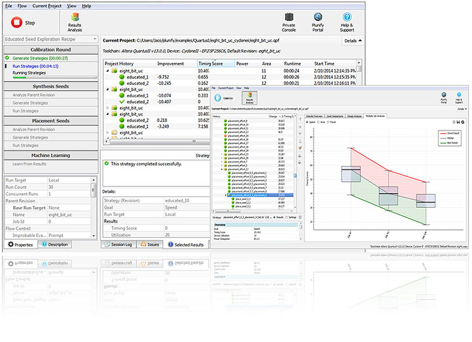

InTime Documentation
====================

Welcome to the InTime documentation. For support, please contact us at <help@plunify.com>. This documentation consists of a few main parts

Contents
========
[Home](index.md)  
[Methodology](intime_flow.md)

Installation
-------------
[Single Seat (Basic) - Under construction]()  
[Multiple Seats (Group/Enterprise)  - Under construction]()

Getting Started
------------------- 
[GUI Mode](quickstart.md)  
[Tcl Script Mode](quickstart_tcl.md)

[Navigating the GUI](gui.md)  
[Selecting Recipes](recipes.md)  
[Using Flow Properties](flow_properties.md)  
[Manage InTime Results](results.md)  

Analyse Results
------------------- 
[Starting the Analysis](analyze.md)  
[Critical Path Analysis](design_analysis.md)

Using Tcl Scripts
-------------------
[Project Mode](project_mode.md)  
[Non-Project Mode](non_project_mode.md)

Advanced Techniques
-------------------
[Constrain Strategies with Settings Filters](setting_filters.md)
[Using Custom Strategies](custom_strategies.md)  
[Reduce RunTime]()  
[Leverage on Previous Results]()  
[Controling Multiple Seats]()  
[Running on Plunfy Cloud]()

Other Commands
-------------------
[Private Cloud Console](private_cloud_administration.md)  

Others
------------------- 
[Tcl Reference Guide](tcl_reference.md)  
[Release Notes]()  
[Tips & Tricks](tips_and_tricks.md)  
[Run Targets](run_targets.md)  
[QuickStart for Quartus](quickstart_quartus.md)  
