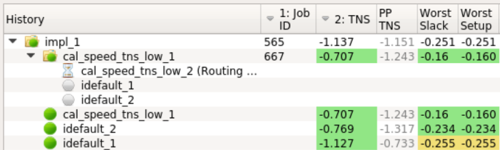
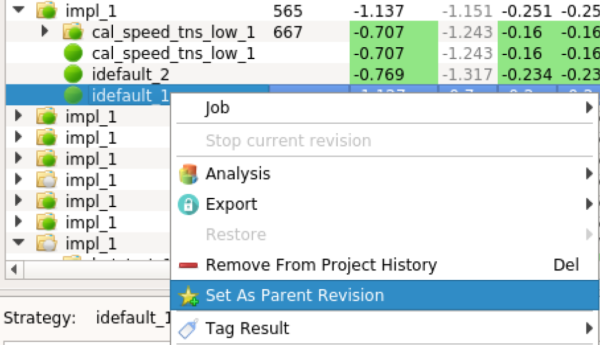

Deciding which recipe to use
============================

The InTime flow is executed using Tcl scripts called *Recipes*. These are different optimization approaches in the InTime flow for different design conditions. For an overview of the InTime flow, see the [intime flow](intime_flow.md) page.

Knowing which recipe to run for a specific design stage or problem is important. To start a recipe in the InTime GUI, just click the *Optimize* button.

When using command line mode, use the following commands.

    # List the available recipes:
    plunify> flow recipes list
    "intime_default" "placement_seed_exploration" ...

    # Run a recipe:
    plunify> flow run_recipe intime_default

## Understanding the InTime Optimization Phases ##

The FPGA tools offers many build parameters that affect an FPGA design on a global as well as local block level. InTime’s goal is to determine the optimum build parameters for the design. To deal with an enormous design space consisting of countless combinations of parameters, InTime uses machine learning techniques and domain-specific heuristics to predict and narrow down the best parameters. To maximize timing closure effectiveness, it is necessary to generate sufficient data points from build results and learn from past results. There are two phases to the optimization process: Phase 1 is the “Learning Lifecycle” and Phase 2, “Last-Mile Optimization”.

**Phase 1: Learning Lifecycle**    
In this phase, the recommended InTime Methodology is to progressively optimize a design over several rounds of synthesis and place-and-route builds in an iterative “build-and-learn” lifecycle.

**Phase 2: Last-Mile Optimization**    
The second phase begins when at least one of the results is close to meeting the performance target or if results have stopped improving in Phase 1. In the former case, the optimization relies on specific techniques that stimulate minor (compared to those in Phase 1) variations in the results. There are two types of optimizations in this phase:  
1. **Random** - Running placement exploration, effort levels and exploiting clock uncertainties.  
2. **Incremental** - Using a particular build to run post-route physical optimization iteratively.

Using this approach, the Phase 1 recipes should be used to improve the original TNS or WNS first, followed by Phase 2 recipes. The ideal effect is highlighted below in the chart.

For more information, please refer to the whitepapers [here](https://www.plunify.com/en/whitepapers/).

## Phase 1: Learning Lifecycle Recipes ##

Also referred to as **educated recipes**, InTime machine learning capabilities to learn from previous results' training data and produce smarter strategies on subsequent runs. There are 4 such recipes.

### Hot Start 

This recipe uses Placement and Routing settings to generate the initial strategies for a project that is being optimized for the first time. The intention is to limit the design space and improve the timing performance in fewer number of compilations.

### InTime Default  

This is a recipe which runs multiple iterations (or rounds). This can be configured under [Flow Properties](flow_properties.md).  It will optimize Synthesis, Placement and Routing settings, creating a large variation in results. 

The expected project history after running this with a default flow configuration (2 rounds, 3 runs per round) can be seen in the project history shown below. Note that after each round, the recipe will set the best result (TNS) from the current round(s) as the parent of the new round. In the example below, the best result is "Cal_speed_tns_low_1" strategy. InTime automatically uses it as the "Parent" for the next round.

The effects of machine learning on a design can also be visualized using the *Multiple Job Analysis* plot in InTime's [Results Analysis](analyze/#multiple-job-analysis) mode. 

### InTime Default Extra 

This recipe behaves the same as the InTime Default Recipe, but it runs an additional optimization round if the TNS is better than -1000ns, or if the Worst Slack is better than -0.5ns. The rationale behind this recipe is that if InTime Default gets you close to meeting the Goal, it will try to close timing by running Last-Mile recipes.

### Deep Dive 

This recipe analyzes existing results and explores regions close to the good results so far. Instead of exploring too many settings, this recipe will lock down settings that are already good and only explore a subset of settings. In the figure below, deep dive recipe gives better results over the default recipe. 

Note that there must be sufficient results (from Default or HotStart) in order for deep dive to work properly.

## Phase 2: Next Steps / Last-Mile Recipes 

Once the machine learning recipes has produced a good result which is very close to achieving the design goals, it is time for Phase 2. The recipes here can be used to "push" the design over the finish line, achieving the design goal.

To do so, **a parent revision must be selected**. Right-click on the best strategy and set the result as the parent
revision of the next round as shown below

Once the custom parent revision has been set, it will be marked with a star as shown below

!!! Tip "Tcl Mode"
    The `flow set parent_revision_name` and `flow set parent_revision_job_id` commands can be used.

### Extra Opt (Vivado only)

This recipe iteratively runs placement, physical synthesis, and routing with different switches to guide the results towards the design goal. In a typical scenario, iteratively placing a design makes the tools work harder on optimizing it, improving the timing performance in the process.

### Placement Exploration (Vivado only)

This recipe finds and change the location of a register to stimulate placement variations. The effect is seemingly random like running placement seeds, which Vivado does not provide anymore.

### Clock Margin (Vivado only)

This recipe varies the clock uncertainty to trigger variations in the timing. By default, InTime will control the degree of clock margin, increasing or decreasing the value by 0.05ns each time. This can be configured by the user. 

### Placement Seed Exploration (Quartus only)

This recipe explores the effect of placement seeds on the design goal. This recipe changes the placement seed setting on the parent revision.

### Effort Level Exploration (Quartus only)

This recipe explores the effect of different effort levels on the design goal. This recipe changes the effort level setting on the parent revision.

### Seeded Effort Level Exploration (Quartus only)

This recipe performs exploration of seeds on best effort level results using the following steps:

Step 1:  Explore placement effort levels on design (20 in total).  
Step 2:  Select the results in the round and set as parent.  
Step 3:  Run "Placement Seed Exploration" recipe on *each* of them.  

If multiple rounds are specified, this recipe will execute step 2 and 3 on the 2nd best, 3rd best result and so on.

The expected project history after running this recipe with a custom parent revision can be seen in the project history shown in jobs 43, 44 and 45) for a flow configuration with `rounds = 2` and `runs_per_round = 3`.

!!! tip
    When running this recipe, the `runs_per_round` property specifies the number of seeds that will be run on the top `rounds` effort levels found.

## General Recipes

There are general recipes which have different use-cases as described in the description of each recipe.

### Just Compile My Design

This recipe simply builds the current active revision or design run in your project. Note that this happens on the run target specified by the `initial_compilation` property.

### Compile with a guide file (Vivado only)

This recipe uses Vivado's incremental compilation behaviour. Using an existing (older version) DCP file, it will only redo placing and routing logic that has changed. 

!!! note
    When running this recipe, make sure the DCP exists. InTime will typically save the generated DCP up to 14 days in the working folders, e.g.  "plunify.jobs/<job ID>"

### Rerun Strategies

This recipe allow the user to rerun previously generated strategies. A typical use case is when a design change is required after timing closure was achieved on the design using a previous InTime strategy. After the design was changed, the *good* strategy can be rerun on the changed design using this recipe.

When this recipe is selected, checkboxes will be shown next to strategies in the project history, allowing the user to select the strategies to rerun. This is illustrated in

The expected project history after running this recipe with the selection shown in the above figure is shown below (job 42).

### Custom Flow Recipe

This recipe runs the InTime flow once with the specified flow configuration. Unlike the other InTime recipes, no properties in the flow configuration are controlled by the recipe, giving full control to the user. When using custom strategy algorithms, this recipe should be used in order to gain control over the `strategy_algorithm` property which is normally locked and controlled by other InTime recipes.
