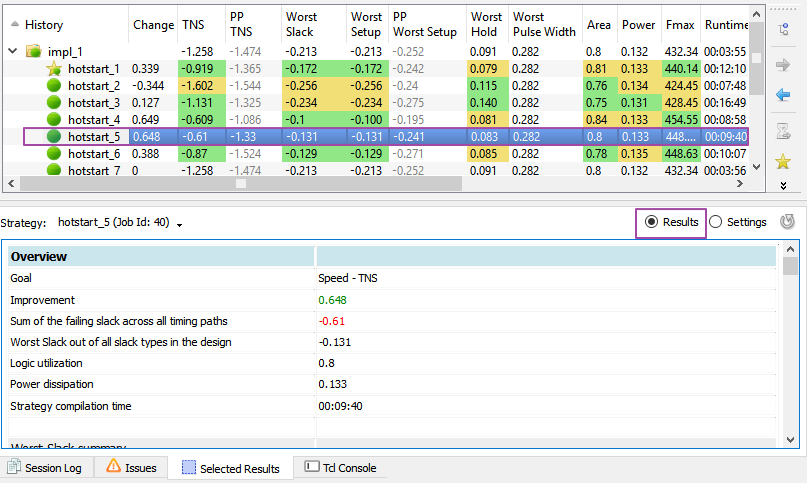

Managing InTime Results
=========================

## Reviewing Results in GUI

The project history keeps track of all InTime runs on a **per project** basis. InTime updates this history while a recipe is running to give continuous updates on which strategies are run as well as the outcomes. Each round is given a job ID and denoted with a folder icon. If there are multiple rounds, each round is organized in a tree format. To expand a round, simply click on the arrow icon next to the folder icon to reveal the next round.

!!! Tip "How to control sorting and column order"
    Clicking on the column name will sort the values in that column. Using the `Ctrl` button, you can sort multiple columns at the same time. You can also drag and drop the columns to change the order in which they appear.

### View Strategy Details

To view more details about any strategy in the project history, select the strategy (or double-click) and click on the *`Selected Results`* tab at the bottom of the GUI. The details of the selected strategy will be shown in this tab as shown below. There are 2 modes of display, "Results" view & "Settings" view.

**Results View**

In the `Results` view, besides the timing information, InTime also tracks information such as "Failing Paths", "Run Time Summary", "Power Summary", "Flow Summary" and machine details including CPU type, RAM. For Vivado, the implementation checksums are also saved.  

!!! Note "Understanding Vivado Implementation Checksums"
    Implementation checksums are necessary for comparing 2 builds. Every result generated in InTime must and can be replicated in Vivado. By monitoring the checksums, one can tell at what point does the build diverge. For example, if the first checksum is different, it means that the synthesis output is different.
 
**Settings View**

In the `Settings` view, the default settings are listed on the right and the settings for the selected strategy is listed on the left.

### Delete Jobs or Strategies
Individual strategies and jobs can be removed individually by right clicking on the result and selecting the appropriate actions. 

 

A prompt will appear to ask you about the type of deletion.

 

1. **Remove Everywhere** - Delete these results from the database and delete the corresponding files from `<project folder>/plunify.jobs/`.

2. **Remove From History Only** - Just delete these results from the database

If you select a job folder, ***all*** the strategies in that folder will be deleted. If you select a strategy, only that strategy will be deleted.

### Compare Strategies

To compare two strategies, select them in the project history panel and
click on `Selected Results` at the bottom of the screen. A detailed
comparison between the two strategies is provided as shown below
 

### Export Strategies to Project

When you have obtained a good result, you can export it to your FPGA software to verify the result. 

To export a result for an XPR project,

1.  *Right-click* the desired result and choose "Export". In the example
    below, we choose the revision \"explore\_1\".
2.  You can apply the selected strategy to your project as a new
    revision or to the default revision. See
    `Figure #figure-quickstart-vivado-export-result`{.interpreted-text
    role="num"} for all available export options.

3.  You can accept the default revision name or specify a new one.

4.  After exporting, open this project in your FPGA software. The
    revision that you exported, *explore\_1*, is now 2 new runs named
    *explore\_synth\_1* and *explore\_impl\_1* for the synthesis and
    implementation portions respectively.

5.  To verify the result, re-run your project to check that the timing
    result is the same as what is reported in InTime. You can view the
    reports provided by the FPGA software to understand more about the
    design.

The TNS and WNS values are equal to those reported by InTime. (Note:
These values are rounded to 2 decimal places in Vivado)

To export a result for a DCP checkpoint,

1.  *Right-click* the desired result and choose **"Export \Save
    Strategy to Tcl Script\..."**. In the example below, we choose the
    revision \"explore\_1\".
2.  You can save the exported Tcl script *apply\_explore\_1.tcl* into
    any directory. See
    `Figure #figure-quickstart-vivado-export-result-dcp`{.interpreted-text
    role="num"} for available export options.

3.  Make a backup copy of the DCP checkpoint, and open it in Vivado.
4.  Go to the Tcl Console and source the exported
    *apply\_explore\_1.tcl* to apply the strategy and start compiling.

5.  The timing result should be the same as what is reported in InTime.

