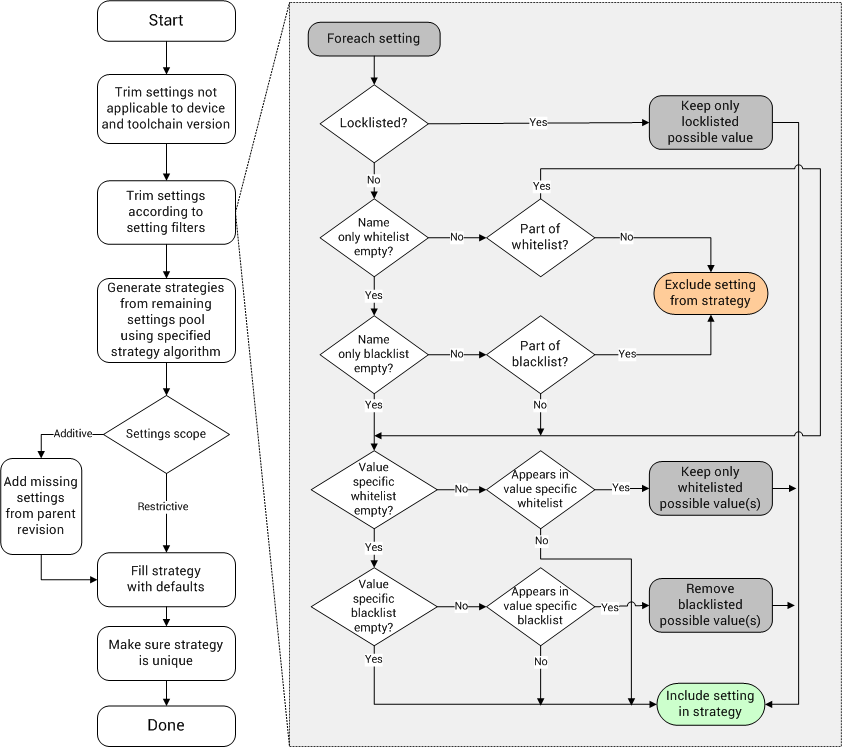

How to use project setting filters
==================================

Overview
--------

Project setting filters allows the user to have full control over the settings which are included in the InTime generated strategies. The following setting filters are available:

-   **Whitelist**: Limits the settings in the generated strategies to
    the settings which are part of the whitelist. 
-   **Blacklist**: Excludes the settings in blacklist from the generated
    strategies. 
-   **Locklist**: Locks the settings in the locklist down to specific
    values. Items in the locklist must be specified using both a setting
    name and setting value. Values in a locklist is different from name
    and value pairs in the whitelist as the locklist always enforces the
    specified values on the generated strategy whereas the whitelist
    only limits the setting to the specified value *if the setting is
    used* by the strategy algorithm.

## Using Setting Filters GUI

Setting filters are managed through an easy to use GUI found under
[Current Project] -\> [Setting Filters] as shown below

In addition to allowing modification of the project's setting filters,
this GUI also allows verification of setting filters and previewing the
exploration space for a set of filters.

Note that many recipes in InTime adds or removes entries from the
project's setting filters while running. When the setting filters GUI
is opened while a recipe is running, the actual setting filters used for
the running job can be inspected, as shown 

The documentation of each recipe provides details of any changes the
recipe makes to the project's setting filters while running (refer to
the *Setting Filter Considerations* subsections). Note that any changes
made to the project's setting filters by a recipe are reverted when the
recipe completes. Use the `job summary <job id>` Tcl command to view the
actual setting filters used for a specific job.

### Saving a template

InTime supports saving and loading custom setting filter templates.
Templates can either be exported directly from the setting filters GUI,
or templates can be created from existing strategies using the right
click context menu as shown

Once a setting filter has been created, it can be applied to the
existing setting filters of a project through using the [More
Action] -\> [Apply Existing Template] action in the setting filters GUI.

## Using Tcl interface

Using the Tcl interface, setting filters are specified using the `project setting_filters` command and its sub commands. To get an overview of all current setting filters for a project, use the
`project setting_filters` command:

    plunify> project setting_filters
    Whitelist:
    Empty

    Blacklist:
    Empty

    Locklist:
    Empty

Some of the common setting filters management commands are listed below.

    # Clears all setting filters in the open project.
    project setting_filters clear

    # List all settings in the open project's specified setting filters.
    # Type is either <blacklist>,<whitelist> or <locklist>.
    project setting_filters <type>

    # Adds the specified setting to the specified list, with <value> being
    # optional (except for locklists).
    project setting_filters <type> add <setting_name> <value>

    # Clears the specified settings filter.
    project setting_filters <type> clear <all,id_only,id_value_only>

    # Checks if specified setting is contained in the specified list, with
    # <value> being optional (except for locklists).
    project setting_filters <type> contains <setting_name> <value>

    # Removes the specified setting from the specified list, with <value> being
    # optional (except for locklists).
    project setting_filters <type> remove <setting_name> <value>

    # Verifies the open project's setting filter combinations.
    project setting_filters verify

    # Lists all settings which can be used in the settings filter
    # for the open project
    project setting_filters available_settings

## Examples

### Educated algorithm usage example

The `educated` algorithm uses existing knowledge in the InTime database
to explore a set of settings and values which are optimized for the
design. To demonstrate the use of setting filters along with the
`educated` algorithm, take a Quartus II project for which the following
exploration needs to be done:

-   `PLACEMENT_EFFORT_MULTIPLIER` should not be touched and the current
    project revision's value for it should be used.
-   `ROUTER_REGISTER_DUPLICATION` is not allowed to be set to `ON` as it
    is causing issues with the design. All other values can be explored.
-   `ROUTER_TIMING_OPTIMIZATION_LEVEL` must be locked down to `MAXIMUM`
    ignoring whatever value is assigned to it in the current project
    revision.
-   All other settings in the current project revision must be respected
    and kept as part of the generated strategies.

This can easily be accomplished using the following setting filters and
setting `strategy_settings_scope` = `additive` in the flow
configuration.

    Whitelist:
    Empty

    Blacklist:
    "PLACEMENT_EFFORT_MULTIPLIER" "ROUTER_REGISTER_DUPLICATION::ON"

    Locklist:
    "ROUTER_TIMING_OPTIMIZATION_LEVEL::MAXIMUM"

### Oneshot algorithm usage: Example 1

The `oneshot` algorithm explores each possible value for each allowed
setting, one strategy at a time. To demonstrate, take a Quartus II
project for which the following exploration needs to be done:

-   Explore the following values for the `SEED` setting: `10`, `20`,
    `30`, `40`, `50`, `60`, `70`, `80`, `90`.
-   All other settings in the current project revision must be respected
    and kept as part of the generated strategies.

This can easily be accomplished using the following setting filters and
setting `strategy_settings_scope` = `additive` in the flow
configuration.

    Whitelist:
    "SEED" "SEED::10" "SEED::20" "SEED::30" "SEED::40" "SEED::50" "SEED::60"
    "SEED::70" "SEED::80" "SEED::90"

    Blacklist:
    Empty

    Locklist:
    Empty

Understanding how setting filters work
--------------------------------------

Setting filters are powerful and gives the user exact control over which
settings in the project InTime touches.
The diagram shows the strategy generation process and how InTime trims
the exploration space using the project's setting filters.

As shown in the above diagram, InTime prioritizes the settings filters
giving the locklist the highest priority followed by the whitelist and
then the blacklist. For example, if a setting and value combination
appears in both the whitelist and blacklist, the combination from the
whitelist will be included since the whitelist has priority over the
blacklist.

Note that in addition to settings filters, the `strategy_settings_scope`
flow configuration property should also be considered when determining
which settings will be part of the final strategy. Also note that setting filters are
saved on a per project basis in the *\<project\_file\>.intime* file in
the project's directory.

!!! tip
    Any changes made to the project's setting filters by a recipe are reverted when the recipe completes. Use the `job summary <job id>` Tcl command to view the actual setting filters used for a specific job.